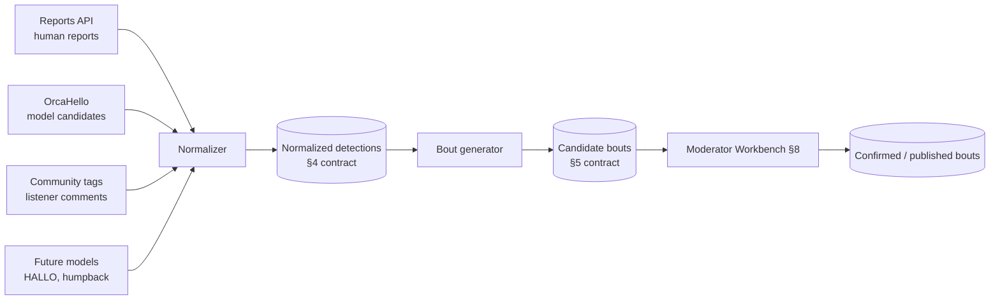
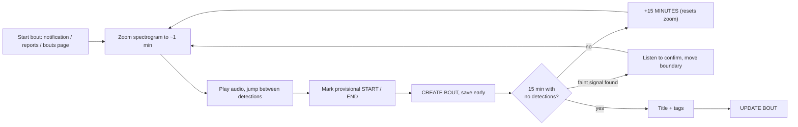
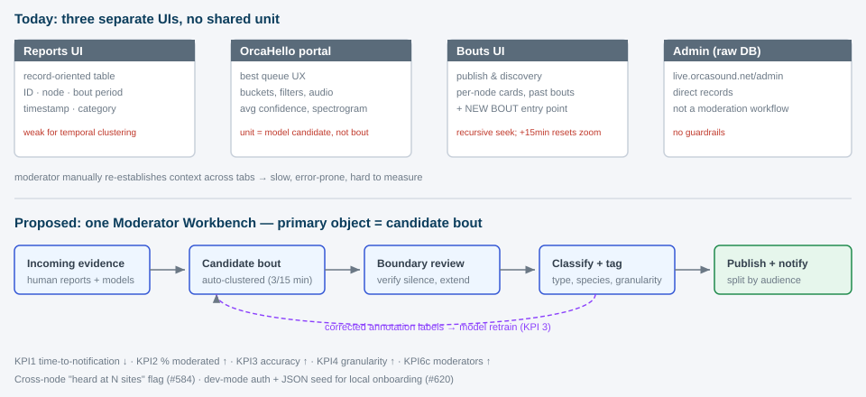
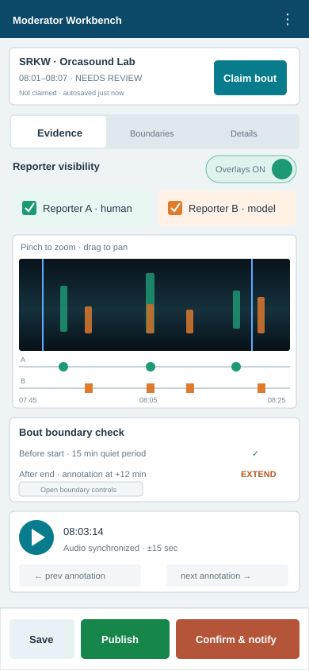
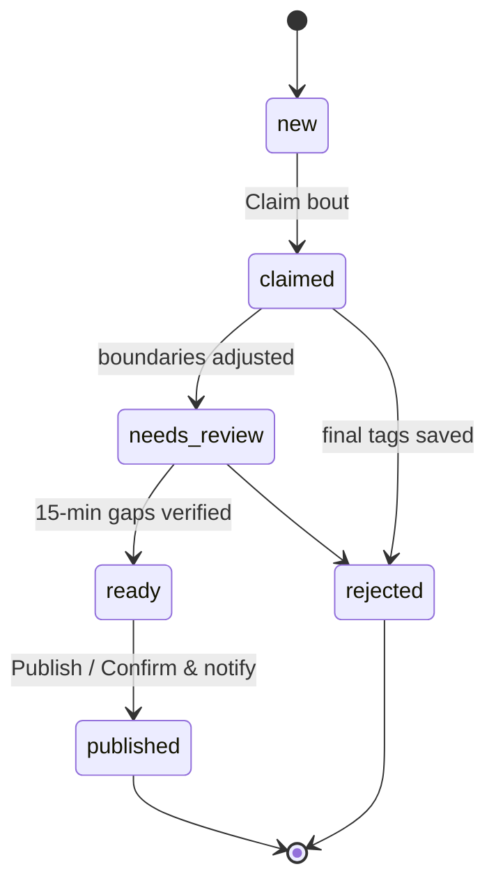

# Bout Specification (Draft v0.4)

> Status: **DRAFT** — evolving. Grounded in the Orcasound moderation guides and a
> 2026-09-14 review of the three live moderator-facing UIs (Bouts, Reports,
> OrcaHello portal), community issues #584 and #620, and a team review of v0.2
> (Dave Thaler annotations, 2026-09-14 and 2026-09-15).
> Moderation guides:
> [orcasite Moderation guide](https://github.com/orcasound/orcasite/wiki/Moderation-guide)
> and [orcahello Moderation guide](https://github.com/orcasound/orcahello/wiki/Moderation).
> See [../research/bout-definition.md](../research/bout-definition.md) and the
> authoritative open questions register in Appendix A.

## 1. Purpose

Define a precise, testable contract for **automatically generating bouts** from a
stream of acoustic detections on an Orcasound hydrophone node, reproducing the
manual moderator workflow — and specify the **moderator experience** that turns
candidate bouts into confirmed, published, and (optionally) notified events.

The algorithm is only half the product: bouts are **assistive candidates** that a
human moderator confirms. This spec therefore covers both the generation contract
(§3–§6) and the moderator workflow/UX it must feed (§7–§11).

## 1a. Source authority (normative)

Moderators are authoritative. Human listeners and machine detectors are both
**reporters**; v1 does not rank either class or depend on reporter reputation.

1. **Moderators — authoritative.** A moderator's confirmed bout (its boundaries,
   type, tags) is the **highest-quality source** and the ground truth for this
   system. Moderator decisions define bouts; everything else only proposes them.
2. **Reporters — candidate evidence.** A detection may come from a human listener
  or machine detector, each identified by `reporter_id`. Treat all non-moderator
  input as candidate evidence of comparable standing in v1. Per-reporter
  reputation MAY be explored later but MUST NOT affect v1 behavior.

Consequences that the rest of this spec MUST honor:

- Any reporter may **propose** a candidate bout; only a moderator can
  **confirm/publish** one. Auto-publishing is out of scope.
- Generated type, title, and tags are editable starting values. A moderator saves
  the authoritative value back to the same field; `review_history` preserves what
  changed, so parallel `suggested_*` and `moderator_*` columns are unnecessary.
- Moderator-confirmed bouts are the **gold labels** for evaluating the generator
  (boundary error, temporal IoU, type/tag accuracy), for **retraining** models, and
  for future model improvement.
- Provenance is preserved end-to-end (`reporter_id`, `created_by`, `reviewed_by`,
  `review_history`)
  so the authority of any field is always traceable.

## 2. Terminology

> Cross-tool note: OrcaHello names differ. What this spec calls a **detection** is
> an OrcaHello **"candidate"**; what it calls a **signal** is an OrcaHello
> **"confirmed detection"** (review #7, #9).

| Term            | Definition |
| --------------- | ---------- |
| **Detection**   | A timestamped **1-minute** acoustic observation on one node (OrcaHello: *candidate*). It may contain one or more approximately 3-second annotation intervals reported by a model. Human reported detections do not contain any 3-second annotation intervals. |
| **Signal**      | A tagged annotation or detection a moderator counts as present (OrcaHello: *confirmed detection*). |
| **Bout**        | A maximal temporal cluster of detections separated by at least 15 minutes with no detections, scoped to one node. Identity is a **(time range + node) pair** — temporal *and* geospatial (review #10). |
| **Node**        | A hydrophone location (e.g., Orcasound Lab, Sunset Bay). |
| **Reporter**    | The human listener or machine detector that produced a detection, identified by `reporter_id`. |

## 3. Bout boundary rules (normative)

Given detections ordered by time on a single node:

- **R1 (automatic boundary):** A bout boundary requires **at least 15 minutes
  with no human or machine detections** before the start and after the end, for the same location and species.
  Ambient audio need not be silent.
- **R2 (maximality):** Extend a bout to include every relevant detection within
  15 minutes of its current boundary.
- **R3 (single source):** All detections assigned to a bout share a single **type**
  (`biophony` | `geophony` | `anthrophony`) and, where identifiable, a single
  **species/source**. Two bouts of the **same** species on the same node do **not**
  overlap in time (they are one bout, per R1–R2). Two bouts of **different**
  species/sources (e.g., an SRKW bout and a humpback bout, or a whale bout and a
  vessel bout) **MAY overlap** in time on the same node. This is confirmed behavior,
  not provisional (2.1 review #41).
- **R4 (node scope):** A bout belongs to exactly one node.
- **R5 (minimum size):** One relevant detection MAY form a bout. There is no
  two-signal minimum (2.1 review #5).

> The **15-minute no-detection gap** is the only programmatically enforced v1
> boundary rule. The moderation guide's audible/visible distinction remains useful
> human review guidance, but neither current database stores it and v1 MUST NOT
> infer it from a spectrogram or confidence score (2.1 review #38, #46–#47).
>
> The 15-minute threshold is common across species. What separates concurrent
> activity is R3: overlap is only possible *between different*
> species/sources, never within one.
>
> **Detection vs bout scope (review #12, #13):** R3 constrains a **bout**, not a
> **detection**. A single 1-minute detection/candidate can legitimately carry
> **multiple** sources/species at once (e.g. a vessel *and* residents in the same
> minute). Such a minute contributes to more than one single-source bout, which is
> exactly why different-species bouts may overlap (R3). Assignment occurs at the
> tag or annotation level: the parent minute can be evidence for each applicable
> bout without being duplicated. Ambiguous annotations remain an open issue.

## 4. Detection input contract

Each detection record SHOULD provide:

| Field          | Type          | Required | Notes |
| -------------- | ------------- | -------- | ----- |
| `id`           | string        | yes      | Stable unique id |
| `node`         | string        | yes      | Hydrophone node id/slug |
| `timestamp`    | ISO-8601 UTC  | yes      | Start of the 1-minute detection window |
| `duration_s`   | number        | yes      | Detection window length; `60` in v1 |
| `annotations`  | object[]      | no       | Approximately 3-second child intervals: `{id, start_offset_s, end_offset_s, confidence, label, tags}`. Offsets are relative to `timestamp`. |
| `tags`         | string[]      | yes      | Flexible vocabulary describing the sound(s): species, `vessel`, pod, call type, etc. Replaces the fixed `source_type`/`species`/`pod`/`call_type` enums, matching OrcaHello (review #17, #19, #20). **May contain multiple** entries (e.g. `vessel` + `srkw`) for one minute (review #12, #13). |
| `confidence`   | number 0..1   | no       | Reporter's confidence (per detection). |
| `reporter_id`  | string        | yes      | Id of the human **or** model that reported it (review #21). Replaces `source` + `model_id`. Multiple reporters for the same minute yield multiple detections that share `audio_uri`/`spectrogram_uri`. |
| `audio_uri`    | string        | no       | Pointer to clip/segment. **Keyed by (timestamp + node), not by reporter** (review #22); shared across co-timed reporters. |
| `spectrogram_uri` | string     | no       | Pointer to the pre-rendered spectrogram, also keyed by (timestamp + node). |
| `description`  | string        | no       | Free-text reporter description. Moderator review text is stored separately as `review_comment`; either may require hide/show moderation. |

> **Multi-reporter / multi-model note (#584, review #21, #22):** When several
> reporters (humans or models) describe the same node-minute, each is its own
> detection distinguished by `reporter_id`, but they **share** the one
> `audio_uri`/`spectrogram_uri` for that (timestamp + node). This matches today's
> databases. Genuine spatial duplication occurs across *adjacent nodes*
> (e.g. Orcasound Lab + Andrews Bay), which are moderated **independently** but MAY
> be linked (see `coincident_with`).

## 5. Bout output contract

### 5.1 Core fields

| Field        | Type          | Notes |
| ------------ | ------------- | ----- |
| `id`         | string        | Generated |
| `node`       | string        | |
| `type`       | enum          | `biophony` \| `geophony` \| `anthrophony` |
| `start`      | ISO-8601 UTC  | First signal in the cluster |
| `end`        | ISO-8601 UTC  | Last signal in the cluster |
| `title`      | string        | Descriptive; node location appended |
| `tags`       | string[]      | Flexible vocabulary (species, pod, call type, `vessel`, etc.); hyphenated |
| `detections` | string[]      | Member detection ids |
| `confidence` | number 0..1   | Aggregate confidence (TBD method) |
| `created_by` | enum          | `model` \| `human` |

### 5.2 Moderation & workflow fields (new in v0.2)

These carry a candidate through the moderator workbench and make every boundary
and decision auditable. The generator initializes the core `type`, `title`, and
`tags` fields in §5.1. A moderator edits those same fields; the saved value is
authoritative and `review_history` records the prior generated value and every
later edit (2.1 review #49).

| Field                  | Type          | Notes |
| ---------------------- | ------------- | ----- |
| `status`               | enum          | `new` \| `claimed` \| `needs_review` \| `ready` \| `published` \| `rejected` |
| `in_progress_by`       | string        | Soft hint that a moderator is working on it (not an exclusive lock; review #26, #41) |
| `reviewed_by`          | string        | Last moderator to save/confirm. Earlier reviewers remain in `review_history`; verify this last-writer model with Dave Bain (§11). |
| `algorithm_version`    | string        | Version of the bout-generation code that created this candidate, e.g. `bouts@0.3`; supports reproduction and comparison after the algorithm changes. |
| `threshold_config`     | object        | Snapshot used to generate the candidate: `{gap_s: 900}` in v1. |
| `start_evidence_status`| enum          | Whether the available window establishes 15 minutes with no earlier detection: `verified` \| `unresolved` \| `contradicted`. |
| `end_evidence_status`  | enum          | Whether the available window establishes 15 minutes with no later detection: `verified` \| `unresolved` \| `contradicted`. |
| `coincident_with`      | string[]      | Bout/candidate ids at adjacent nodes for the same event (#584) |
| `review_history`       | object[]      | `{who, when, field, from, to}` change log |

> Preserve `detections` (member ids) always: it is what makes an automatically
> generated boundary **explainable** to the moderator.
>
> A generated title is not stored separately. The generator initializes `title`;
> a moderator may overwrite it. Generated suggestions remain reproducible from
> tags, annotations, and `algorithm_version`, while history preserves edits.
>
> **Notifications are not stored per bout (review #29).** Rather than a
> `notify_audiences` field on each bout, audiences **subscribe** to the entries
> they care about (by node, tag/species, type, confidence). The set of recipients
> is computed per audience at notify time, which scales better than per-bout lists.
> See per-user notification settings in §9.

## 6. Type derivation (tags → candidate bout type)

The generator derives one coarse initial `type` for each candidate bout from
its member detections' `tags` (there is no singleton detection-level `bout_type`
or fixed `source_type` enum, review #17). A mixed detection can contribute to
more than one candidate, so type is assigned only after evidence is split into
single-source candidate bouts:

- tags implying wildlife (e.g. `srkw`, `biggs`, `humpback`, `seal`) → `biophony`
- tags implying human activity (e.g. `vessel`, `sonar`, `pile-driving`) → `anthrophony`
- tags implying natural phenomena (e.g. `storm`, `earthquake`) → `geophony`
- ambiguous / mixed → needs classification or moderator choice (a minute may carry
  tags of more than one class; see R4 detection-vs-bout note in §3)

## 6a. Data normalization across sources (normative)

The moderator surfaces today each speak a different dialect: the **Reports** table
(human reports: id, node, detections, timestamp, categories, source, description),
the **OrcaHello** portal (model candidates: id, node, timestamp, N detections,
average confidence, spectrogram, audio), and the **Bouts** page (published bouts).
A combined UX (§8) is only possible if all of them are first normalized into the
**one detection contract** in §4 and, once confirmed, the **one bout contract** in
§5. Normalization is the seam that lets human, model, and community data sit in the
same timeline.

> Prior art (review #33): OrcanodeMonitor's **Node Detections** view already does a
> cross-database join across these sources and is a useful reference for the
> normalizer's joins and node mapping.

### 6a.1 Required normalization steps

| Concern | Rule |
| ------- | ---- |
| **Node identity** | Map every source's node label to one canonical `node` slug (e.g. `rpi-orcasound-lab` → `orcasound-lab`). Maintain a single node lookup table. |
| **Time** | Store all timestamps as **ISO-8601 UTC**; convert source-local zones (e.g. OrcaHello's PDT) on ingest. Preserve original second-precision start. |
| **Reporter & authority** | Set `reporter_id` to the human or model that reported it (review #21). Multiple reporters for one minute → multiple detections. Do not rank reporters in v1. |
| **Granularity** | Normalize a detection to a 60-second parent window; preserve model or moderator call intervals as child `annotations` with relative offsets. |
| **Tags** | Carry the source's tags through as a flexible list (species, `vessel`, pod, call type); do **not** force into a narrow enum (review #17, #19, #20). Derive the candidate's initial coarse `type` only when forming a bout (§6). |
| **Confidence** | Normalize to 0..1. Keep **per-detection** confidence; never collapse to a single average before the moderator sees it. |
| **Media** | Resolve `audio_uri`/`spectrogram_uri` to stable URLs keyed by **(timestamp + node)**, shared across co-timed reporters (review #22); the live OrcaHello blobs 404 intermittently — cache/pin them. |
| **Identity & dedup** | Assign a stable `id` per (reporter, timestamp, node); co-timed reporters are distinct detections sharing one media asset (review #22), not merged (#584). |
| **Comments** | Carry reporter `description` and moderator `review_comment` separately, each with a hidden/shown moderation flag so junk can be suppressed without data loss. |

### 6a.2 Normalization guarantees

- **Lossless provenance:** original source id, node label, timezone, and raw
  confidence are retained alongside the normalized fields for audit.
- **Idempotent:** re-ingesting the same source record yields the same normalized
  `id` (no duplicates on replay).
- **Authority-preserving:** normalization never promotes a model/community row to
  moderator authority (§1a); only a moderator action does.

## 6b. Unified database and API proposal

This section compares the two live persistence/API surfaces and defines a single
target. Here, **SQL** means Orcasite's PostgreSQL database; **Cosmos DB** means the
OrcaHello document store. The comparison is based on the published
[Orcasite OpenAPI specification](https://live.orcasound.net/api/json/open_api),
[OrcaHello OpenAPI specification](https://aifororcasdetections.azurewebsites.net/swagger/v1/swagger.json),
[Orcasite detection resource](https://github.com/orcasound/orcasite/blob/main/server/lib/orcasite/radio/detection.ex),
and [OrcaHello detection DTO](https://github.com/orcasound/orcahello/blob/main/ModeratorFrontEnd/AIForOrcas/AIForOrcas.DTO/API/Detections/Detection.cs).

### 6b.1 Current formats and responsibilities

| Concern | Orcasite / PostgreSQL | OrcaHello / Cosmos DB |
| ------- | --------------------- | --------------------- |
| Primary unit | One human or machine report in `detections` | One model-generated audio clip/candidate document |
| Identity | UUID `id`; optional unique `idempotency_key` | String/GUID `id` |
| Node | Required `feed_id` relationship; `feeds` holds slug, names, coordinates, stream and storage metadata | Embedded `location` (`name`, `latitude`, `longitude`); API also filters by `HydrophoneId` |
| Time | `timestamp`; legacy playback coordinates `playlist_timestamp` + `player_offset` | `timestamp`; annotation offsets are relative to the clip |
| Classification | Nullable `category` (`whale`, `vessel`, `other`) plus normalized `tags`/`item_tags` elsewhere in Orcasite | Semicolon/comma-delimited `tags`, computed `tagList`, `suggestedTagList`, and `globalPredictionLabel` |
| Model evidence | `source` (`human`/`machine`), `candidate_id`, description | `annotations[]` (`id`, `startTime`, `endTime`, `confidence`, `label`), average `confidence`, computed `aiModel` |
| Moderation | `visible`, editable description/category, related candidate; bouts and tags are separate relational resources | Cosmos `reviewed`, `SRKWFound` (`yes`, `no`, `don't know`), `comments`, `moderator`, `dateModerated`; the API renames `SRKWFound` to `found` and `dateModerated` to `moderated` |
| Media | Derived from feed streams/segments and generated spectrograms | `audioUri` and `spectrogramUri` point to Blob Storage |
| Public API | JSON:API; list/create detections, list bouts/feeds/streams/segments; deep filters, includes, sparse fields and offset pagination | Plain JSON; list by review bucket, get/update one detection, tags and metrics; page/time/location filters |

Not every API property is a stored database field. In particular, OrcaHello's
`tagList`, `suggestedTagList`, and `aiModel` are computed by the DTO. Conversely,
Orcasite stores `inserted_at`, `updated_at`, `user_id`, `candidate_id`, and
`idempotency_key`, although not all are present in its default API projection.
Orcasite's `visible` means whether a report is shown; it MUST NOT be interpreted
as the bout algorithm's `detectability = visible` (§4).

The APIs also use **detection** differently. Orcasite means an individual report;
OrcaHello means a model clip containing zero or more annotation intervals. The
unified model preserves both levels instead of flattening annotations or treating
an average confidence as several independent observations.

### 6b.2 Canonical relational model

Use one PostgreSQL database as the system of record. Audio and spectrogram bytes
remain in object storage; the database stores stable URIs and metadata only.

| Table | Purpose and key fields |
| ----- | ---------------------- |
| `feeds` | Existing canonical node registry: `id`, `slug`, `name`, coordinates and storage/stream metadata. Preserve `orcahello_id` as an external alias during migration. |
| `reporters` | Humans and models: `id`, `kind`, `name`, `model_version`, `created_at`, `updated_at`. A future reputation extension may add derived metrics without changing detection ownership. |
| `media_assets` | One shared clip/window per node and time: `id`, `feed_id`, `timestamp`, `duration_s`, `audio_uri`, `spectrogram_uri`; unique on `(feed_id, timestamp, duration_s)`. |
| `detections` | One reporter's observation: `id`, `feed_id`, `timestamp`, `duration_s`, `reporter_id`, `media_asset_id`, `description`, `confidence`, `idempotency_key`, `source_system`, `source_record_id`, `raw_payload`, `created_at`, `updated_at`. |
| `annotations` | Optional sub-interval evidence: `id`, `detection_id`, `start_offset_s`, `end_offset_s`, `confidence`, `label`; unique on `(detection_id, id)`. |
| `tags` / `detection_tags` | Existing normalized vocabulary and many-to-many detection assignments; never store a delimited tag string in the target schema. |
| `detection_reviews` | Append-only moderator decisions: `id`, `detection_id`, `status`, `comment`, `reviewed_by`, `reviewed_at`, `created_at`. The current decision is the newest review, not a set of independently mutable flags. |
| `candidate_bouts` / `candidate_bout_detections` | Generated grouping, workflow, editable type/title/tags, boundary evidence, algorithm version, and member detections from §5. |
| `bouts` / `bout_detections` | Moderator-confirmed/published interval and its evidence. Reuse Orcasite `bouts`, `tags`, and feed relationships where compatible. |

Required constraints:

- All timestamps are UTC `timestamptz`; offsets and durations are decimal seconds.
- Detection confidence is stored on a 0..1 scale. Import OrcaHello percentages by
  dividing by 100 while retaining the original value in `raw_payload`.
- `status` is `unreviewed`, `confirmed`, `false_positive`, or `unknown`. Map
  `reviewed = false` to `unreviewed`. The legacy decision is Cosmos `SRKWFound`,
  exposed by the API as `found`. Mapping its `yes/no/don't know` values to the
  other three statuses is provisional pending the species-scope decision in §11;
  do not retain contradictory `reviewed`/decision states.
- `idempotency_key` is unique when present. Otherwise enforce uniqueness on
  `(source_system, source_record_id)` so migration and event replay are safe.
- Deleting a tag removes an assignment, not historical review data. Tag rename is
  one transaction against `tags`, avoiding OrcaHello's update of every document.
- `raw_payload` is migration/audit evidence, not a second application schema; new
  code reads and writes typed columns and relations.

### 6b.3 Unified field names and mappings

Canonical names use `snake_case`, matching the existing Orcasite database/API and
the §4 contract. This minimizes physical renaming: Orcasite fields remain in place,
while the .NET API can map its current PascalCase properties at the boundary.

| Canonical field | Orcasite source | OrcaHello source | Decision |
| --------------- | --------------- | ---------------- | -------- |
| `id` | `id` | `Id` | Preserve source ids where globally unique; otherwise generate UUID and retain `source_record_id`. |
| `feed_id` | `feed_id` | `HydrophoneId` or mapped `Location.Name` | Keep the existing FK. Expose the related feed `slug` as §4 `node`. Never join on display name after migration. |
| `timestamp` | `timestamp` | `Timestamp` | Keep; convert to UTC on ingest. |
| `duration_s` | Derived from report/media window | Clip duration | Canonical seconds; do not infer it from annotation span. |
| `reporter_id` | Map `user_id` or machine actor | Derive from `AIModel` / `GlobalPredictionLabel` | Use a reporter FK per §1a; retain legacy `source` only during compatibility rollout. |
| `description` | `description` | None | Reporter-supplied observation text. This replaces §4's ambiguous `comment` name. |
| `confidence` | None | `Confidence` | Detection-level 0..1 value; retain per-annotation confidence separately. |
| `audio_uri` | Resolve from feed stream/segment | `AudioUri` | API projection from `media_assets`; shared by node/time, not duplicated per reporter. |
| `spectrogram_uri` | Generated/segment-derived | `SpectrogramUri` | Same treatment as `audio_uri`. |
| `tags` | `tags` through `item_tags` | Parsed `Tags` / `TagList` | API array backed by normalized join rows. `SuggestedTagList` remains computed. |
| `status` | Candidate/moderation state where available | API `Reviewed` + `Found`; Cosmos `reviewed` + `SRKWFound` | One enum replaces the two potentially contradictory flags, subject to the `SRKWFound` scope decision in §11. |
| `review_comment` | None distinct from description | `Comments` | Store as `detection_reviews.comment`, not on `detections`. |
| `reviewed_by` | Moderator user relation where available | `Moderator` | Reporter/user FK where resolvable; retain original identity for audit. |
| `reviewed_at` | Audit timestamp where available | `Moderated` | UTC review event time. |
| `annotations[]` | None | `Annotations` | Child rows using `start_offset_s`, `end_offset_s`, `confidence`, `label`. |
| `source_system` | Constant `orcasite` | Constant `orcahello` | Explicit provenance; not a substitute for `reporter_id`. |

Moderator text is `review_comment`; API responses may temporarily return
deprecated `comment` and `comments` aliases. Keep `playlist_timestamp` and
`player_offset` as legacy
Orcasite playback fields until all clients resolve media by `media_asset_id`; do
not introduce those fields into new clients.

### 6b.4 Unified API surface

Publish one versioned API under `/api/v1`; use snake_case JSON resource fields and
one error envelope. Preserve the current Orcasite JSON:API routes as compatibility
adapters during migration rather than forcing both applications to switch at once.

| Operation | Purpose |
| --------- | ------- |
| `GET /api/v1/detections` | Filter by `feed_id`/`node`, time range, `reporter_id`, tag, status, confidence, or source system; cursor paginate and sort by timestamp/confidence. |
| `POST /api/v1/detections` | Idempotently submit a human or model observation, optional annotations and media reference. |
| `GET /api/v1/detections/{id}` | Return one detection with reporter, media, tags, annotations, and current review; use explicit `include` parameters for larger relations. |
| `POST /api/v1/detections/{id}/reviews` | Append a moderator decision. Do not use a broad replacement `PUT` for review history. |
| `GET /api/v1/candidate-bouts` | Work queue filtered by status, node, time, tag, confidence, or assignee. |
| `PATCH /api/v1/candidate-bouts/{id}` | Autosave workflow and moderator fields with optimistic concurrency. |
| `POST /api/v1/candidate-bouts/{id}/publish` | Transactionally create/update the authoritative bout and record reviewer/audit data. |
| `GET /api/v1/bouts` | Read published bouts and member evidence; retain the existing public bouts adapter. |
| `GET /api/v1/tags` and `GET /api/v1/feeds` | Shared controlled vocabulary and canonical node registry. |

Review buckets such as OrcaHello's `/unreviewed`, `/confirmed`, `/falsepositives`,
and `/unknowns` become saved filters over `status`, not separate implementations.
Metrics are projections/queries over the same review data, not mutable detection
properties. Dates accept ISO-8601 UTC ranges; do not continue the locale-specific
`mm/dd/yyyy` API convention.

### 6b.5 Storage-engine decision

**Option A — consolidate in PostgreSQL (recommended).**

Pros:

- Reuses Orcasite's existing feeds, bouts, tags, users, stream metadata, public
  API, moderation authorization, and generated-media workflow.
- Fits the target's many relationships and constraints: shared media, multiple
  reporters, annotation rows, tag joins, append-only reviews, candidate membership,
  publication transactions, subscriptions, and audit history.
- Supports cross-source time/node queries and tag/metric aggregation without
  denormalized documents or application-side joins.
- Requires fewer canonical field renames because Orcasite already uses snake_case
  names and owns most destination entities.

Cons:

- OrcaHello's .NET persistence and query layer must be replaced or redirected.
- Embedded annotation arrays become child rows, increasing ingest operations.
- Very high sustained model-ingest volume would eventually require partitioning,
  retention policies, and careful index management.

**Option B — consolidate in Cosmos DB.**

Pros:

- Reuses OrcaHello's document shape and model-ingest path with minimal initial
  changes; annotations naturally remain embedded.
- Provides elastic horizontal writes, configurable retention, and regional
  distribution for independently readable detection documents.
- Allows new model payload fields to arrive before a relational migration exists.

Cons:

- Requires moving or duplicating Orcasite's relational feeds, users, tags, bouts,
  subscriptions, stream segments, permissions, and audit relationships.
- Referential integrity, unique cross-document identities, many-to-many tags, and
  atomic candidate-to-published-bout workflows move into application code.
- The dominant moderator queries span node, time, reporter, tag, review state, and
  bout membership; their cost and feasibility depend heavily on a partition key,
  with no single key serving all access patterns.
- Tag rename/delete, metrics, and any future reporter-quality calculations fan out across
  documents or require additional materialized containers.
- It produces more total migration work because the desired product is broader
  than OrcaHello detections and already lives primarily in Orcasite.

**Decision:** move OrcaHello detection documents into Orcasite PostgreSQL and make
PostgreSQL the sole live system of record. This recommendation is driven by data
shape and ownership, not a general claim that SQL is always preferable to Cosmos
DB. Keep Blob Storage for media. A temporary importer or change-feed consumer MAY
dual-write during cutover, but dual databases are not the target architecture.

### 6b.6 Migration sequence and acceptance criteria

1. Freeze the canonical field dictionary above and publish generated OpenAPI
   schemas for it; add `reporters`, `media_assets`, `annotations`, and
   `detection_reviews` without changing existing public routes.
2. Populate the feed alias map (`orcahello_id`, location name, canonical slug),
   then backfill reporters and media assets before detections.
3. Import Cosmos documents idempotently, parse tags into join rows, normalize
   confidence/status, and retain each original document in `raw_payload`.
4. Run shadow reads comparing counts and samples by node/day/status/tag, plus
   annotation counts, timestamps, media URIs, and moderation decisions.
5. Point the OrcaHello UI at `/api/v1`, then stop Cosmos writes. Keep the old APIs
   as read/translation adapters for a measured deprecation window.
6. Remove adapters and Cosmos only after backups, rollback rehearsal, and signed
   reconciliation results are complete.

Migration is acceptable only when every source record has exactly one provenance
key, no UTC timestamp changes unexpectedly, review-bucket counts reconcile, all
tags and annotations are preserved, media links resolve at the agreed success
rate, and repeated imports create no duplicates. Authorization tests MUST prove
that only moderators can append reviews or publish bouts.

## 7. Moderator workflow (what we are reproducing)

Learned from the Orcasound Moderation guide and observed in the live UIs. Bout
creation today is a **recursive boundary-seek loop** that is slow and easy to
lose context in:

**Pain points to remove:**

- `+15 MINUTES` resets zoom, forcing a re-zoom to ~1 min every iteration.
- Saving is manual and intermittent (`UPDATE BOUT`).
- "Average confidence" hides per-detection uncertainty.
- Human reports and model detections live in different UIs.
- No shared unit of work: Reports = record, OrcaHello = model candidate, Bouts =
  published bout, Admin = raw DB row.

## 8. Target UX: one Moderator Workbench

Rather than a fourth UI, consolidate into a single **Moderator Workbench** whose
primary object is a **candidate bout**; human reports and model detections are
shown as *evidence*.

The workbench keeps zoom persistent, autosaves every edit, and makes the
15-minute no-detection boundary rule explicit rather than something the moderator
reconstructs by scanning separate tools.

### 8.0 Combined UX: unifying the surfaces

The goal is **one workflow, three lenses on the same normalized data** (§6a) —
not four disconnected apps. Each existing surface becomes a *view* over the shared
detection/bout model rather than its own silo:

| Surface today | Role in combined UX | Shares |
| ------------- | ------------------- | ------ |
| **Reports** | Evidence feed / triage list; `+ NEW BOUT` seeds a candidate | Same detections, node table, timeline component |
| **OrcaHello portal** | Model-candidate queue; deep-links into the workbench for boundary work | Same candidate object, confidence, spectrogram, audio player |
| **Bouts page** | Published output + discovery; `+ NEW BOUT` per node card | Same bout contract, tags, titles |
| **Admin (raw DB)** | Break-glass record access only | Same underlying store |

Principles for the combined experience:

- **One candidate object** flows across surfaces; entry points (notification,
  Reports, Bouts card, OrcaHello) all open the **same** workbench on the **same**
  candidate — no re-keying.
- **Shared components:** one timeline, one audio player, one spectrogram, one tag
  picker, reused everywhere. Desktop keyboard commands and phone touch controls
  invoke the same actions and preserve the same state.
- **Consistent identity & state:** `status` (§5.2) is the single source of truth
  for where a candidate is; every surface reads/writes it.
- **Deep-linkable:** any candidate/bout is addressable by URL so moderators can
  hand off work (and #620 local seeds can target a specific candidate).
- **Progressive disclosure:** public views show confirmed bouts; the moderator
  view adds evidence lanes, boundary tools, and actions (create bout, hide
  comment, notify) as the guide describes.

### 8.1 Panels

The workbench is a single screen divided into four panels. Read left to right,
they follow the moderator's natural flow: **pick** work, **inspect** the evidence,
**set** the boundaries, then **decide and publish**.

**1. Bout queue (left) — pick the next candidate.**
A prioritized worklist of candidate bouts. Each item is one candidate, tagged with
its workflow `status` (§5.2: `new`, `claimed`, `needs_review`, `ready`,
`published`, `rejected`) so a moderator can see at a glance what still needs
attention. Candidates can be grouped by node, type, and time so related activity
sits together, and filtered by node, type, species, confidence, or age. The queue
surfaces the most uncertain work first — conflicting classifications and
low-confidence boundaries rise to the top. An explicit **Claim bout** action sets
the bout-level `in_progress_by` hint; opening a candidate does not claim it. The
claim is advisory, not an exclusive lock, and another moderator may take over with
confirmation. Detection-level claiming is only a compatibility workaround and is
not part of the target model (2.1 review #30, #43).

**2. Evidence timeline (center) — inspect what was detected.**
A single continuous spectrogram with synchronized audio playback, so the moderator
sees and hears the same stretch of time in one place. Beneath it, detections are
drawn as parallel **per-reporter lanes**, confirmed as the primary pivot in the
2.1 review (#44). The spectrogram and every lane share one horizontal time scale:
a marker at time $t$ is vertically aligned with the same instant in the
spectrogram. Each reporter row has an on/off control that hides or restores both
its lane markers and its corresponding spectrogram overlay. A separate
**Signals overlay** control hides all colored reporter overlays while retaining
the raw spectrogram, enabling an unbiased audio/visual review; it does not remove
the underlying detections from the candidate. Reporter A and B may be compared
alone or together. Every detection shows its own confidence, and selecting one
reveals its tags, reporter, source, and annotation interval.

**3. Boundary verification (center, below the timeline) — set the start and end.**
This is where the moderator confirms exactly where the bout begins and ends. The
start and end are draggable handles on the shared time axis. For each boundary,
the panel shows whether the available data contains **15 minutes with no earlier
or later detection** and marks it `verified`, `unresolved`, or `contradicted`.
This is evidence about detection timestamps, not a claim that ambient audio is
silent. "Jump to next / previous detection" controls move quickly between records,
and extending the window with `+15 min` **keeps the current zoom level**. Audio
around the boundary is prefetched for instant playback, and every change is
**autosaved**.

**4. Bout metadata & decision (right) — classify, then publish.**
The final panel captures the bout's descriptive fields and the publish action.
Generated type, title, and tags are editable in place; moderator saves overwrite
those fields while `review_history` records the change (§1a). Tags are selected
from a controlled vocabulary with a free-form fallback. Provenance shows all
contributing reporters and `algorithm_version`. If the candidate is wrong, the
moderator rejects it and applies final tags; there is no separate
`rejection_reason`, because retraining uses tagged 3-second samples rather than
bouts (2.1 review #42, #48). When it is right, publishing makes the bout eligible for notification; the
recipients are resolved from **audience subscriptions** (§5.2, review #29), not
picked per bout. The moderator finishes with `Save draft`, `Publish bout`, or
`Confirm & notify`.

### 8.2 Responsive phone view

The phone view provides the full review workflow without shrinking the desktop
three-column layout. It uses a single vertical flow:

1. A compact candidate header shows node, time, state, and an explicit
  **Claim bout** action.
2. The evidence view appears first, with a horizontally scrollable/pinch-zoomable
  spectrogram and aligned reporter lanes. Reporter and **Signals overlay** toggles
  remain visible directly above it.
3. A segmented control switches among **Evidence**, **Boundaries**, and **Details**
  without losing playback position, zoom, reporter visibility, or unsaved edits.
4. Boundary controls use large touch targets and show the 15-minute no-detection
  status in plain text. Metadata fields use native mobile inputs.
5. A sticky bottom action bar exposes `Save`, `Publish`, and `Confirm & notify`;
  destructive reject remains in the Details view to avoid accidental taps.

The minimum target is a 390 CSS-pixel viewport. Controls MUST remain at least
44 by 44 CSS pixels, text and actions MUST NOT overlap, and horizontal scrolling
is limited to the time-aligned spectrogram/lanes region. Desktop and phone views
operate on the same candidate URL and server state.

### 8.3 Candidate lifecycle

## 9. Cross-cutting improvements from community feedback

| Source | Learning | Spec response |
| ------ | -------- | ------------- |
| #584   | Multiple reporters/models share one candidate (tags/comments identical); real overlap is across **adjacent nodes**, moderated independently | `reporter_id` on detections; `coincident_with` on bouts; "heard at N sites" flag for localization |
| #620   | Contributors can't get a signed-in moderator locally → onboarding wall (KPI 6c) | Emit candidate bouts as **JSON seed** for a local portal; support a dev-only no-auth mode consuming that seed |
| Dave B | Mod UI works well; biggest win = **false positives** (model retrain) + **split notifications** | Final tags on 3-second samples feed retraining; notifications split via **audience subscriptions** (review #29) |
| Dave T (review) | Reporter quality may vary by reporter; use **tags** not narrow enums; avoid hard locking | Equal reporter standing in v1; tag-based contract (§4); explicit advisory bout claim (§5.2) |
| Dave T | Want **per-user notification settings** and **human+machine side by side** | Audience subscriptions + per-reporter evidence lanes (§8.1) |

## 10. KPIs the moderator UI can move

| KPI | Lever in this spec | Realistic near-term target |
| --- | ------------------ | -------------------------- |
| **1. Time-to-notification** | Pre-computed candidate + one-click `Confirm & notify` | Cut confirm\u2192notify to minutes; halve current median |
| **2. % historical detections moderated** | Keyboard-driven queue, batch actions, node grouping | Measurable weekly throughput lift on backlog |
| **3. Prediction accuracy** | Moderator tags on 3-second samples feed retraining | Every reviewed sample retains usable final tags |
| **4. Labeling granularity** | Flexible **tags** (species, pod, call type, `vessel`) + audience subscriptions | Enable audience-specific notifications (residents, PIGU) |
| **6c. Unique moderators** | Local onboarding via JSON seed + dev-auth (#620) | Lower time-to-first-merged-PR |

> KPI 5 ($/month) and KPI 6a/6b (listeners/subscribers) are largely outside the
> moderator UI (infra/marketing); the UI helps them only indirectly via better,
> more relevant notifications.

## 11. Open design decisions

The authoritative register is **Appendix A**. Remaining themes are:

- How to fuse human + model detections into a single candidate.
- Aggregation method for bout `confidence`.
- Controlled tag vocabulary and audience-group taxonomy.

**Resolved (2026-09-14):**

- **One automatic boundary rule:** at least 15 minutes with no human or machine
  detection. Audible/visible classification and a separate 3-minute threshold are
  not programmatically enforced in v1 (2.1 review #38, #46–#47).
- **Different-species bouts may overlap** in time on the same node; same-species
  bouts never do (R3). Confirmed in the 2.1 review (#41).
- **A single detection may form a bout;** there is no two-signal minimum (2.1
  review #5).
- **Flexible tags replace narrow enums** (`source_type`/`species`/`pod`/
  `call_type`) and `reporter_id` replaces `source`+`model_id` (review #17, #19,
  #20, #21).
- **Notifications via audience subscriptions**, not a per-bout field (review #29).
- **No detection-level `bout_type`:** candidate bout type is derived after a mixed
  detection's tags are assigned to one or more single-source candidates (second
  review #6).
- **Generated values are editable in place:** the generator initializes type,
  title, and tags; moderator edits overwrite them and history preserves changes
  (2.1 review #49).
- **Per-reporter lanes are the default** and each reporter/overlay can be hidden
  without removing underlying evidence (2.1 review #44 and §8.1).
- **Reporter reputation is future work** and v1 does not depend on it (2.1 review
  #39).
- **No separate rejection reason:** final tags on 3-second samples are sufficient
  for retraining (2.1 review #42, #48).

## 12. Acceptance criteria

1. Two relevant detection groups separated by at least 15 minutes with no human
  or machine detections produce **two** bouts.
2. Two relevant detection groups separated by less than 15 minutes produce
  **one** bout for the same species/source.
3. A single relevant detection MAY produce one bout; no minimum count above one
  is imposed.
4. Detections assigned to different `type` or species/source values never merge
  into the same bout (R3).
5. Detections on different nodes never merge (R4).
6. Two different species overlapping in time on one node yield **two** distinct
  bouts; two same-species clusters within 15 minutes yield **one**.
7. Each emitted bout carries member `detections`, `algorithm_version`, and
  `threshold_config` so its grouping can be reproduced.
8. Moderator edits overwrite generated type/title/tags, `review_history` preserves
  the prior values, and no code path auto-publishes without confirmation (§1a).
9. Spectrogram marks and reporter-lane markers share the same time coordinate;
  toggling one reporter hides that reporter's lane and overlay only, while
  toggling **Signals overlay** reveals the raw spectrogram without overlays.
10. At 390 CSS pixels, the phone view exposes evidence, boundaries, details,
   reporter toggles, playback, claim, save, publish, and notify actions without
   overlap or loss of state between views.

## Appendix A. Open questions register

This appendix is the single authoritative list of unresolved specification
questions as of 2026-09-15. Prototypes, scripts, fixtures, and synthetic data MAY
be used to test a proposed answer, but are validation aids rather than project
deliverables. Resolved decisions remain in the normative sections above and are
not repeated here.

### A.1 Bout semantics and data model

| ID | Open question | Why it matters / proposed direction |
| -- | ------------- | ----------------------------------- |
| A | **Mixed-source annotation assignment:** when one 1-minute parent has tags or 3-second annotations for several species/sources, which annotations belong to each overlapping bout, and how are ambiguous untagged intervals handled? (review #12, #13; 2.1 #40) | The parent detection may reference multiple bouts without duplication, but membership needs a deterministic annotation/tag rule and a moderator override. |
| B | **Boundary evidence persistence:** store `threshold_config` and start/end evidence states, or recompute them? (second review #11–#13) | Proposed: retain `{gap_s: 900}` and status snapshots for reproducibility; remove any field proven deterministic from immutable inputs plus `algorithm_version`. |
| C | **`SRKWFound` semantics:** does `no` mean no SRKW specifically or no relevant whale sound at all? (second review #23) | Blocks safe mapping of Cosmos `SRKWFound` / API `found` to generic `confirmed` and `false_positive`; another species may still be present. |
| D | **Confidence aggregation:** how is bout `confidence` calculated across reporters and annotations? | Needed for ranking, moderator display, evaluation, and reproducible API behavior. Do not hide per-detection values behind an average. |
| E | **Controlled vocabulary:** which tag hierarchy and audience-group taxonomy is canonical, and who governs additions/renames? | Required for interoperable classification, filtering, metrics, and subscriptions while preserving free-form evidence. |

### A.2 Evidence, scope, and validation

| ID | Open question | Why it matters / proposed direction |
| -- | ------------- | ----------------------------------- |
| N | **Representative records and access:** which human reports, model outputs, archived audio, detections, and existing bouts can specification authors access, under what credentials and rights? | Real records must validate field mappings and examples. Synthetic records should cover only missing edge cases. |
| O | **Initial validation slice:** which nodes and time windows should be used first? | A bounded, representative slice is needed to check node aliases, timestamps, media resolution, mixed sources, and migration reconciliation. |
| P | **Reference catalogs:** should the SRKW click/call and humpback catalogs be normative dependencies now or deferred? | Determines whether catalog identifiers and versions belong in canonical tags and API contracts. |
| Q | **Gold labels:** can moderator-created historical bouts be obtained for evaluating proposed boundary rules? | Needed to define meaningful boundary error, temporal IoU, type/tag accuracy, and representative worked examples. |
| R | **Approval evidence:** what is sufficient to approve a specification rule: worked examples, historical-bout validation, stakeholder review, quantitative thresholds, or a required combination? | Makes specification changes reviewable without turning validation scripts into deliverables. |

### A.3 Compatibility and nonfunctional requirements

| ID | Open question | Why it matters / proposed direction |
| -- | ------------- | ----------------------------------- |
| S | **Compatibility constraints:** which Orcasite Elixir/PostgreSQL, OrcaHello .NET, and existing-client behaviors must remain compatible, and for how long? | Determines adapter scope, deprecation policy, naming aliases, and migration sequencing. A preferred test language is not a specification decision. |
| T | **Nonfunctional requirements:** what latency, throughput, retention, availability, privacy, security, regional, and cost constraints belong in the specification? | These constraints may change the storage/API recommendation even though no production implementation is part of this deliverable. |
