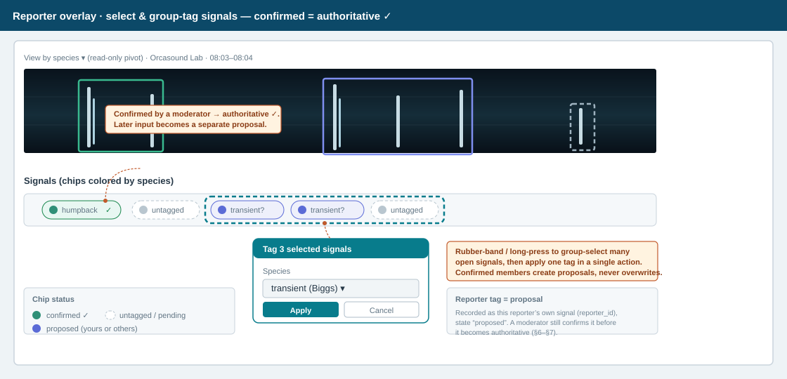
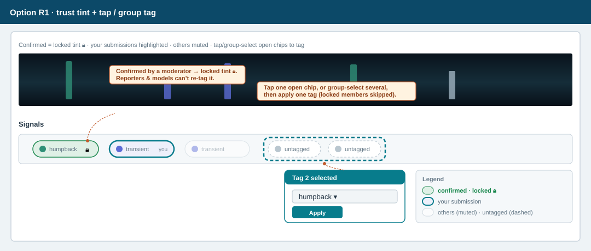
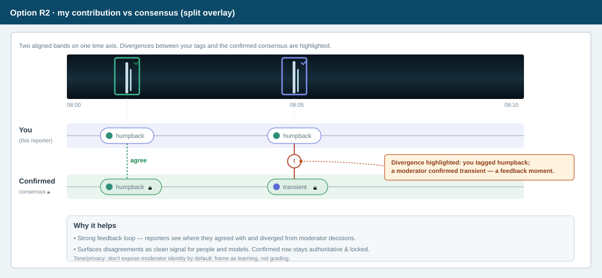
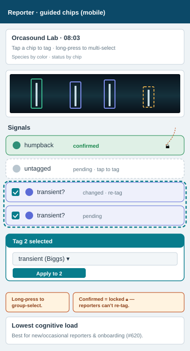
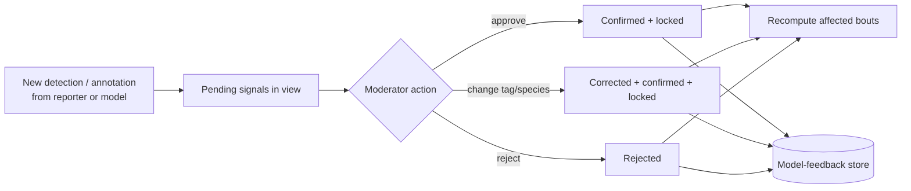
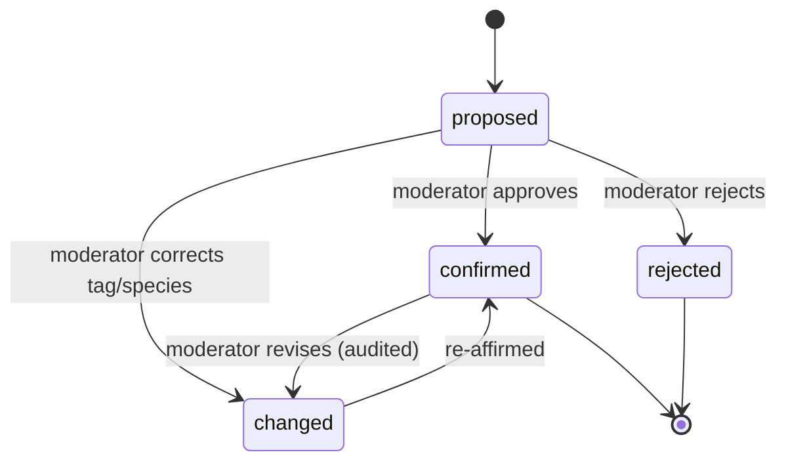

# Moderator & Reporter Overlay + Realtime Signal Approval — UX Proposal (Draft v0.1)

> Status: **DRAFT / EXPLORATORY** — companion to
> [bout-spec.md](bout-spec.md). This document proposes UX options; it does not
> replace the normative contracts in the bout spec. Where it introduces new data,
> those additions are proposals for §6b.2 of the bout spec.
> Grounded in a 2026-09-16 request to (a) improve the evidence **overlay** for both
> moderators and reporters and (b) add a **realtime signal-approval** surface for
> moderators.

## 1. Purpose & scope

Two related goals:

1. **Evolve the Moderator Workbench overlay.** Today's overlay (bout-spec §8.1)
   pivots almost entirely on *who reported* a signal (human vs model, per-reporter
   lanes). That is necessary but insufficient. Moderators also need to see, at a
   glance:
   - which signals are **already moderated/confirmed** vs still **unverified**;
   - when a single timeframe contains **mixed species that split into two bouts**
     (e.g. a humpback bout and a Biggs/transient bout overlapping in time);
   - when signals **change under them** — a confirmation or a correction
     (humpback → transient) that can move a bout boundary — both on the bout they
     are actively editing and on bouts they have previously worked.
2. **Add a Realtime Signal Approval console** — a moderator-only surface for
   reviewing **signals outside of any bout** and confirming them against the
   proposed detection. A confirmed signal becomes authoritative and is **locked**
   against later reporter/model overwrites. The console is **time-first** (default
   1-minute span, zoomable) and supports select → listen → tag → approve.

The main overlay is also **pivotable**: a one-tap control flips the same signals
between a *who reported* view (per-reporter lanes) and a *what is here* view
(species/source lanes) — see §4.0.

Reporters get an overlay too, but a **read + propose** one: they must be able to
tell what a moderator has already confirmed (locked, unchangeable by a reporter or
model) versus what is still open, and they may **select signals** — including quick
group selection — to **tag** ones that are untagged or look mis-tagged. Reporter
tags are proposals (§5); they never overwrite a confirmed signal.

Out of scope here: the bout generation algorithm (bout-spec §3–§6), notification
delivery mechanics (bout-spec §9), and storage-engine choice (bout-spec §6b.5).

## 2. Terminology used here (delta over bout-spec §2)

| Term | Meaning in this document |
| ---- | ------------------------ |
| **Signal** | The reviewable unit: a tagged ~3-second **annotation**, or a whole 1-minute **detection** when it has no sub-annotations (consistent with bout-spec §2). |
| **Proposed detection** | The reporter's or model's *unconfirmed* claim about a signal — its interval and tag(s) — before a moderator acts. |
| **Confirmed signal** | A signal a moderator has approved. It is **locked**: reporters and models may not overwrite it (they may still submit *new* signals). |
| **Moderation state** | Per-signal review status (see §7): `proposed`, `confirmed`, `changed`, `rejected`. Distinct from the *bout* `status` in bout-spec §5.2.1. |
| **Watcher** | A moderator who is working, or previously worked, a bout and should be alerted when its evidence changes (§8). |

## 3. Why the current overlay is not enough

The current overlay (see [images/moderator-workbench.svg](images/moderator-workbench.svg))
encodes **reporter identity** with lane + color (Reporter A human / Reporter B
model). That answers "who said this?" but not:

- **"Is this signal trustworthy yet?"** — confirmed vs unverified is invisible; a
  moderator can build a bout on evidence that no human has vetted.
- **"Are there really two things here?"** — a minute with both humpback and
  transient calls looks like one busy lane, not two overlapping bouts.
- **"Did something move?"** — if another moderator confirms/corrects a nearby
  signal, the boundary can shift silently; there is no change signal.

The options below add these three encodings **without** throwing away the
per-reporter view that already works.

> **Rendering convention (matches the live site).** The sonogram always shows the
> sound waveform with bright **bursts** where energy is detected. A signal tag is
> drawn as an **empty outlined rectangle around** its burst — never a solid fill —
> so the waveform stays visible inside the box. Encoding rides on the box's
> *outline and badges* (color = species, border style = state, corner glyph =
> source), not on an opaque fill. Two species in one timeframe are two overlapping
> boxes.

---

## 4. Moderator overlay — proposed options

Each option is evaluated against the three needs: **(M-state)** show moderation
status, **(Species)** show mixed-species/two-bout overlap, **(Alerts)** show
changes.

### 4.0 Baseline capability — “Who” and “What” as separate, combinable layers

The main interface treats **Who (source)** and **What (species)** as two
*independent layers*, not a single either/or view, because they answer different
questions and routinely co-occur (a vessel *and* residents in the same minute):

- **What · species** is drawn as a **color** layer — translucent species regions and
  top color bands on the spectrogram.
- **Who · source** is drawn as a **shape** layer — neutral glyphs on the same signals
  (● human, ▪ model). Keeping source to *shape* leaves *color* free for species, so
  both layers can be read at once without collision.

Each layer has its **own on/off control**, and the default shows **both at the same
time**. This visual distinction — color for What, shape for Who — is exactly what lets
them be displayed together.


**The toggle is for the lower bars.** Below the spectrogram, the same signals are
also laid out as grouped **swimlane rows**. A one-tap toggle sets whether those
*lower bars* are grouped **by Who** (per-reporter lanes) or **by What** (species
lanes). The toggle only regroups the lower bars; it does **not** turn off either
upper layer, and it preserves zoom, playback, selection, and the underlying
evidence.

```text
Layers:  [x] What · species (color)   [x] Who · source (shape)
Lower bars grouping:  (•) by Who   ( ) by What        ⟵ toggle
```


**Encoding channels (shared vocabulary).** Every §4 option and the reporter overlay
(§5) reuse the same channel assignment, so the four concerns never fight over the
same visual variable and can be shown simultaneously:

| Concern | Channel |
| ------- | ------- |
| **What** · species / source-type | **color** (hue / region) |
| **Who** · reporter (human vs model) | **shape** (● human, ▪ model) and/or lane |
| **Moderation state** | **fill / border** (✓ solid = confirmed·locked, hatch = proposed, amber ring = changed, strike = rejected) |
| **Change alerts** | **motion** (pulse) + minimap ✦ |

All of these ride on the tag box's **outline, badges, and glyphs** — the box
interior stays empty so the waveform burst remains visible (see the rendering
convention in §3).

Option M3 generalizes the lower-bar grouping to a third choice (group by moderation
state) in addition to Who/What.

### Option M1 — Status as a visual layer on today's reporter lanes (evolutionary)

Keep per-reporter lanes and the Signals overlay. Add three lightweight encodings:

- **Moderation state via border/badge (keeping tag boxes empty):** confirmed = solid outline + ✓ badge;
  unverified = hatched/outline; changed = amber ring; rejected = struck-through.
- **Species via a thin color stripe** along the top edge of each marker.
- **Change alerts via a pulse + count chip** on markers whose underlying signal
  changed since the panel opened.

```text
Reporter A (human)  ┤  ▢✓   ▣✓        ▢!        │  ✓=confirmed  ▢=proposed
Reporter B (model)  ┤    ▨     ▨   ▨      ▨      │  !=changed    ▨=unverified
                       └── species stripe: ▔hump ▔transient ──┘
```


**Pros**
- Smallest change; reuses muscle memory and existing components.
- Cheapest to build; incremental rollout.

**Cons**
- Each marker now carries **three** encodings (lane + species stripe + state
  fill) → overload/legibility risk, especially on phones.
- The two-bout/mixed-species case is still cramped into per-reporter rows; overlap
  is inferred, not shown structurally.
- Colorblind safety gets harder with more simultaneous color channels.

Handles: M-state ✔ · Species ~ (weak) · Alerts ✔

### Option M2 — Species-first swimlanes (re-pivot)

Make **species/source** the *default* primary grouping (flip to the reporter pivot
anytime, §4.0). Each species gets its own lane band
(Humpback, Biggs/transient, Vessel, …). Within a band, reporter is a small glyph
and moderation state is the fill/badge. Two overlapping bouts render as two clearly
separated bands, each with its **own** boundary handles.

```text
 Humpback   ┤  ●✓ ─────────── bout #1 boundary ──────────  │ ●human ■model
 Transient  ┤        ■ ■✓ ■ ──── bout #2 boundary ────      │ ✓ confirmed
 Unassigned ┤   ▨        ▨            (needs species)         │ ▨ unverified
```


**Pros**
- The mixed-species / two-bout timeframe is **immediately legible** — the split is
  structural, not inferred.
- Overlay aligns with bout identity (species + node + time), so boundaries read
  naturally per species.
- Moderation state is still visible per signal.

**Cons**
- Comparing the *same reporter* across species is harder (reporter is now
  secondary).
- More vertical lanes; an "Unassigned/ambiguous" holding lane is required for
  minutes whose species is not yet determined (ties to bout-spec Appendix A item A).
- Requires a species assignment step before a signal can be placed.

Handles: M-state ✔ · Species ✔ (strong) · Alerts ✔

### Option M3 — Layered canvas with switchable pivot + facet toggles (power tool)

One spectrogram; the §4.0 pivot control is extended to a **third option** —
(Reporter | Species | Moderation state) — and the moderator can toggle facets on/off. Confirmed signals
render with a padlock. A **minimap ribbon** above the timeline shows signal density
and change markers across the whole session, so alerts are visible even off-screen.

```text
Pivot: (•)Species ( )Reporter ( )State    Facets: [x]confirmed [x]proposed [ ]rejected
minimap ▁▂▅█▅▂▁  ← change ✦ at 08:04 ─────────────────────────────────
[ main spectrogram + overlay rendered per current pivot ]
```

**Pros**
- Most flexible; supports all three needs and future ones (e.g. confidence,
  call-type) by adding facets rather than redesigns.
- Each moderator tunes the view to the task (triage vs boundary work).
- Minimap makes off-screen changes discoverable.

**Cons**
- Highest complexity and build cost; needs excellent defaults or it overwhelms.
- Discoverability/consistency risk (two moderators may see different pivots).
- Harder to document and QA.

Handles: M-state ✔ · Species ✔ · Alerts ✔ (strong)

### Moderator overlay — comparison

| Option | M-state | Species / two-bout | Alerts | Build cost | Overload risk |
| ------ | :-----: | :----------------: | :----: | :--------: | :-----------: |
| M1 evolutionary | Good | Weak | Good | Low | High |
| M2 species-first | Good | **Strong** | Good | Medium | Medium |
| M3 layered/switchable | Good | Strong | **Strong** | High | Medium‑High |

**Recommendation:** ship **M2 as the default overlay** (it directly solves the
mixed-species/two-bout requirement), and adopt **M3's minimap ribbon** as the
alert mechanism layered on top. Keep M1's fill/badge language as the shared
moderation-state vocabulary across every option and across the reporter view.

---

## 5. Reporter overlay — proposed options

Reporters **report sounds, not bouts** (bout-spec §1a). Their overlay is
**read + propose**: they can see what is confirmed (locked) vs open, and they can
**select signals and tag them** when a signal is untagged or looks mis-tagged.



The reporter overlay reuses the §4.0 **encoding channels** — species = color,
source = shape, state = fill/border, locked = padlock — so “Who” and “What” remain
separable here too.

Rules for reporter tagging:

- A reporter tag is a **proposal**, recorded as that reporter's own signal under
  their `reporter_id`; it never mutates another reporter's signal or the original
  proposed detection. A moderator still confirms it (§6, §7).
- **Confirmed = locked:** if a moderator has already confirmed a signal, a reporter
  (or model) cannot re-tag it. The UI disables tagging on locked signals and shows
  the padlock; the `locked` guard (§7) enforces this server-side.
- **Quick group select:** reporters can rubber-band or range-select many signals
  and apply one tag in a single action, so correcting a run of untagged calls is
  fast. Any locked signals in the selection are skipped, not overwritten.
- The pivot toggle (§4.0) is available read-only to reporters, so they can view
  signals by species as well as by reporter.

### Option R1 — Trust tint + tap / group tag

Same spectrogram; confirmed signals use a distinct **locked** style + padlock, the
reporter's own submissions are highlighted, everyone else's are muted. The reporter
can tap an open signal — or group-select several — to add or correct a tag;
confirmed signals are non-editable.



**Pros**
- Simple and safe; reinforces the authority model (bout-spec §1a) while still
  allowing light correction of open signals.
- Minimal build; works on phones.

**Cons**
- Limited insight; doesn't teach reporters much about species overlap or
  disagreements beyond the tint.

### Option R2 — "My contribution vs consensus" split overlay

Two stacked bands: top = *this reporter's* signals; bottom = the confirmed /
aggregated consensus. Divergences are highlighted (e.g. "you tagged **humpback**;
a moderator confirmed **transient**").



**Pros**
- Strong feedback loop; teaches reporters and improves future reports.
- Surfaces disagreements explicitly — useful signal for both people and models.

**Cons**
- More UI; risk of discouraging casual contributors if divergences feel like
  "grading."
- Needs careful tone and privacy (don't expose moderator identity by default).

### Option R3 — Guided single-lane with status chips (casual / mobile-first)

One lane; each signal is a chip colored by species with a small status chip
(`pending` / `confirmed` / `changed`). Tap a chip to tag it, long-press to
multi-select a group and tag them together; confirmed chips are locked. Optimized
for onboarding (#620) and phones.



**Pros**
- Lowest cognitive load; best for new/occasional reporters and mobile.
- Easy to learn; good first-run experience.

**Cons**
- Hides multi-reporter nuance and precise timing.
- Not an analysis tool.

### Reporter overlay — comparison

| Option | Confirmed-vs-open clarity | Teaching / feedback | Mobile fit | Build cost |
| ------ | :-----------------------: | :-----------------: | :--------: | :--------: |
| R1 trust tint | Good | Low | Good | Low |
| R2 split consensus | Good | **High** | Medium | Medium |
| R3 guided chips | Good | Low‑Med | **High** | Low |

**Recommendation:** default reporters to **R3** (approachable, mobile-first) with
an opt-in **R2** "compare with moderator decisions" mode for engaged contributors.
All three support **select + group-tag of open signals** and **lock confirmed
signals**, and all reuse the M1/M2 moderation-state vocabulary so confirmed = the
same padlock/✓ everywhere.

---

## 6. New surface — Realtime Signal Approval console (moderator-only)

A dedicated, **time-first** surface for reviewing signals **outside** of bout
construction and confirming them against the proposed detection. Confirming
**locks** the signal (§7). Default span is **1 minute**; the moderator can zoom out
(hours) or in (seconds). Core loop: **see → select → listen → tag/approve**.


### Shared requirements (all options)

- **Time axis with zoom:** default 1-min window; zoom presets 10 s / 1 min /
  15 min / 1 h; horizontal scrub with audio kept in sync.
- **Select:** one signal, a rubber-band range, a checkbox list, or "all pending in
  view."
- **Multi-select approve (first-class):** a single **Approve** — or **Change tag**
  or **Reject** — applies to the **entire selection** in one action, with a
  keyboard/gesture shortcut for "approve all in view." Any locked signals in the
  selection are skipped, not overwritten. This is the primary throughput lever and
  MUST be available in every option and on phone.
- **Listen:** scoped playback of the selected signal/region (or sequential
  playback across a multi-selection).
- **Tag/approve:** approve as-is, change the tag/species, or reject; the chosen tag
  applies to the whole selection; edits write to the main database (§7), not a side
  store.
- **Lock on confirm:** once confirmed, reporter/model ingestion may not overwrite;
  only a moderator can revise, and every revision is audited.
- **Live intake:** newly arriving detections stream into the "pending" set in near
  real time.
- **Encoding note (differs from §4.0):** the console reviews one proposed detection
  at a time and has no species swimlanes, so here **color encodes Who** (source:
  human vs model) and **species is shown as the tag**, with state still on
  fill/border. The §4.0 “color = What” rule applies to the *overlay*, not this
  single-signal review surface.

### Option S1 — Time-rail triage inbox (list-centric)

Left: chronological, keyboard-navigable list of pending signals bucketed by minute.
Right: detail pane with 1-min spectrogram, audio, tag editor, and
Approve / Change / Reject. Optimized for **backlog throughput**.

**Pros**
- Fastest per-item throughput; familiar inbox pattern; excellent keyboard flow.
- Great for clearing historical backlog (KPI 2).

**Cons**
- Weak spatial/temporal context; clustering and overlaps are hard to see.
- Zoom is per-item, not continuous.

### Option S2 — Continuous timeline scrubber (timeline-centric) — recommended

A horizontally scrolling spectrogram at 1-min default zoom; signals are selectable
blocks. Select one/many → listen → tag → approve inline. Zoom changes the span.
Confirmed blocks show a padlock and lock from further reporter/model writes.

```text
[◀ 08:03 ──────── 08:04 ──────── 08:05 ▶]   zoom: 10s · [1m] · 15m · 1h
spectrogram ░▒▓ signals: ▢proposed  ▣✓confirmed  ▨model  ▧human
select ▢▢  →  ( Listen )  ( Tag: transient ▾ )  ( Approve )  ( Reject )
```


**Pros**
- Directly matches the "**view by time, default 1 minute, zoomable**" ask.
- Strong temporal context; batch-approve consecutive signals; overlaps visible.
- Same timeline/audio/spectrogram components as the Workbench (reuse).

**Cons**
- Per-item approval can be slower than S1 for a huge undifferentiated backlog.
- Needs a good multi-select and "approve selection" affordance.

### Option S3 — Proposed-vs-confirmed compare view (reconciliation)

Two aligned tracks: **model-proposed** detections above, **human-proposed** below;
the moderator confirms the correct interpretation or writes a corrected tag.
Emphasis on reconciling *proposed detection* against the signal.

**Pros**
- Best for disagreements and for generating clean **model-eval / retraining**
  labels (§9).
- Makes the "confirm against proposed detection" intent explicit.

**Cons**
- Narrower use; heavier UI; overkill for simple, uncontested confirmations.

### Approval console — comparison

| Option | Time-first / zoom | Throughput | Context | Model-feedback value | Build cost |
| ------ | :---------------: | :--------: | :-----: | :------------------: | :--------: |
| S1 triage inbox | Partial | **High** | Low | Medium | Low‑Med |
| S2 timeline scrubber | **Strong** | Medium‑High | **High** | Medium | Medium |
| S3 compare view | Strong | Medium | High | **High** | High |

**Recommendation:** build **S2 as the primary console**, with **S1 available as a
"triage mode" toggle** for backlog blitzes and **S3 as a focused "reconcile"
mode** entered from a disputed signal. All three write through the same review API
and share the timeline component with the Workbench.

### Responsive phone view (all options)

The approval console has a phone layout so moderators can clear pending signals
away from a desk. It is not a shrunk desktop grid; it is a single vertical flow that
keeps the same review contract.


1. A compact header shows node, "live" state, and the pending count.
2. Zoom presets (10 s / **1 min** / 15 min / 1 h) sit above a pinch-zoomable,
   scrubbable spectrogram; tapping a block selects it.
3. **Multi-select is first-class on phone:** tap blocks, drag a marquee, use the
   checkbox list, or "Select all in view." A selection summary shows the count and
   time span.
4. **Listen** plays the selection (scoped or sequential); a single **Tag** applies
   to all selected.
5. A **sticky bottom bar** exposes **Approve all (N)**, **Change**, and **Reject**;
   approve/change confirm + lock the whole selection, skipping any locked members.
6. Live intake updates the pending badge without losing the current selection,
   zoom, or playback position.

Minimum target 390 CSS-pixel viewport; controls ≥ 44×44 CSS px; horizontal
scrolling limited to the time-aligned spectrogram. Desktop and phone operate on the
same signals and server state (mirrors bout-spec §8.2).

### Approval flow



---

## 7. Proposed data-model additions

These extend the canonical relational model in **bout-spec §6b.2**. All additions
are UTC, append-only where they carry decisions, and preserve provenance.

### 7.1 Per-signal moderation state

Add an explicit, queryable state to the reviewable unit (annotation, or detection
when it has no annotations). Prefer a dedicated column plus an append-only review
history over a mutable flag.

| Field | Table | Type | Purpose |
| ----- | ----- | ---- | ------- |
| `moderation_state` | `annotations` (and `detections` for annotation-less minutes) | enum | `proposed` \| `confirmed` \| `changed` \| `rejected`. Drives the overlay padlock/✓ and the reporter read-only lock. |
| `locked` | same | boolean | True once confirmed/changed by a moderator; ingestion MUST NOT overwrite a locked signal (only a moderator may revise). |
| `confirmed_species` / `confirmed_tag_id` | same | FK | The authoritative species/tag a moderator affirmed (may differ from the proposed one — e.g. humpback → transient). |
| `confirmed_by` | same | FK → user | Moderator who confirmed/changed it. |
| `confirmed_at` | same | timestamptz | When it was confirmed/changed. |

`signal_reviews` (append-only, mirrors `detection_reviews`): `{id, signal_ref,
prior_state, new_state, prior_tag, new_tag, actor, at, comment}`. The current state
is the newest review; history is never mutated.

> The bout-spec already has `detection_reviews` (`unreviewed|confirmed|
> false_positive|unknown`). This proposal **refines that to the signal level** and
> renames values to the four above for the approval loop. Reconcile during
> migration: `confirmed`→`confirmed`, `false_positive`→`rejected`, `unreviewed`→
> `proposed`, `unknown` stays a distinct holding value (see open issue U-6).

> **Reporter tagging & the lock (§5).** A reporter tag creates a **new proposed
> signal** under that reporter's `reporter_id` (state `proposed`); it never edits
> another reporter's signal or a locked one. The `locked` guard is enforced
> server-side, so the API rejects any reporter/model write targeting a confirmed
> signal — the UI's disabled state is a convenience, not the security boundary. A
> group-tag action fans out to one proposed signal per selected interval and
> silently skips locked members.

### 7.2 Species assignment & multi-bout membership (for the species-first overlay)

| Field | Table | Type | Purpose |
| ----- | ----- | ---- | ------- |
| `species_source` | `annotations` and `detections` for annotation-less signals | tag/enum | Species/source of the signal, enabling the species-first swimlanes (Option M2). Nullable → renders in the "Unassigned" lane. |
| `signal_bout_membership` | new join table | rows | `{signal_ref, bout_id, role}` — lets one minute's signals belong to **multiple** overlapping bouts without duplication (bout-spec §3 detection-vs-bout note, Appendix A item A). |

### 7.3 Change tracking & watchers (for alerts)

| Field / table | Type | Purpose |
| ------------- | ---- | ------- |
| `change_events` (new) | rows | `{id, entity_type: bout\|signal, entity_id, change_type, from, to, actor, at, affected_bout_ids[]}`. One row per moderation change; drives all alerting. |
| `bout_watch` (new) | rows | `{bout_id, user_id, reason: working\|worked, created_at}`. Populated when a moderator claims/edits a bout, and retained after publish so prior reviewers can be alerted later. |
| `boundary_dirty` | `candidate_bouts` | boolean | Set when an approval/rejection near a boundary means the bout's start/end may need recomputation; clears when a moderator accepts or dismisses the recomputed boundary. |

### 7.4 Model-feedback fields

| Field / table | Type | Purpose |
| ------------- | ---- | ------- |
| `model_feedback` (new) | rows | `{id, signal_ref, model_reporter_id, model_label, model_confidence, moderator_label, decision: approve\|change\|reject, at, export_state}`. The clean supervised signal for retraining/eval (§9). |
| `export_state` | `model_feedback` | enum | `pending` \| `exported` \| `excluded`. Lets ambiguous/unknown items be withheld from training. |

---

## 8. Change propagation & alerts

When a signal is confirmed, changed, or rejected, the effect can ripple into bouts:

- **Reject** a signal that anchored a boundary → a 15-min gap may open → a bout may
  **split** or **shrink**.
- **Confirm/add** a signal inside a former gap → two bouts may **merge** or a bout
  may **grow**.
- **Change species** (humpback → transient) → the signal leaves one species bout
  and joins another; **both** bouts' boundaries may move.

Design:

1. Every change writes a `change_events` row with `affected_bout_ids`.
2. Affected candidate bouts get `boundary_dirty = true`; the generator recomputes
   proposed boundaries but **does not auto-publish** (bout-spec §1a).
3. **Active editors** of an affected bout see an inline, non-destructive banner
   ("Evidence changed — review new boundary") with optimistic-concurrency conflict
   handling.
4. **Watchers** (`bout_watch.reason = worked`) get an inbox/notification badge:
   "A bout you reviewed changed," linking to a diff of before/after.

### 8.1 Existing-bout correction: orca signal → seal

A reviewer opens an existing orca bout from the Bouts page or from an "A bout you
reviewed changed" alert. The Workbench opens in **review existing bout** mode and
keeps the bout boundary visible while the species overlay shows each member
signal. The reviewer selects the misidentified orca signal and listens to its
exact interval; the details panel shows its current `orca` identification,
reporter/model provenance, confidence, moderation state, and review history.

The reviewer chooses **Change**, selects `seal`, and sees an inline preview before
confirming:

- the signal moves from the orca lane to the seal lane;
- the signal leaves the orca bout and joins or seeds the applicable seal bout;
- every affected bout is listed with its current and proposed boundaries; and
- any title, type, tag, split, or merge consequence is called out explicitly.

Confirming writes a `signal_reviews` entry (`orca` → `seal`), keeps the signal
locked against reporter/model overwrites, records model feedback, and emits one
`change_events` row naming all affected bouts. Those bouts become
`boundary_dirty`; the reviewer accepts or adjusts each proposed boundary change
rather than the system silently applying it. Correcting the signal does not by
itself publish a bout or notify subscribers (see U-7).

### 8.2 Existing-bout correction: unidentified opening signals → ship

A reviewer opens an existing bout and zooms to the small unidentified signals at
its beginning. They drag a marquee over the run, then add or remove individual
signals by Shift-click on desktop or checkboxes on phone. The selection summary
shows the count, total time span, current tags and lock states. **Listen to
selection** plays the intervals in sequence so the reviewer can verify that the
whole group has the same ship source before changing it.

The reviewer chooses **Change selection**, identifies the source as **ship**
(canonical tag `vessel`), and receives one confirmation screen for the batch. The
screen lists every signal that will change and flags any item that cannot be
revised under the moderator-override policy (U-3); an ineligible item is never
silently skipped. The preview moves the selected signals into a vessel lane and
shows the resulting anthrophony/vessel bout. If those signals anchored the
original bout's start, it also proposes moving that boundary to the first
remaining signal and displays both bouts before and after the change.

Confirming creates one append-only `signal_reviews` record per selected signal,
corresponding `change_events` and model-feedback records, and an audit link that
groups them as one batch action. The reviewer then accepts or adjusts the proposed
bout changes. The batch update never silently republishes a bout or sends a
subscriber notification.



---

## 9. Recent high-value bouts

Moderators need a quick way to revisit strong examples so they can calibrate what
clear, useful signals look and sound like. Add a **Recent bouts** view that uses
the same bout cards, timeline, audio player, and species/source overlays as the
Workbench. It is a review and learning surface, not another moderation queue.

### 9.1 Ranking and filters

The default **High value first** order is deterministic and transparent:

1. Bouts carrying the moderator-assigned `high-value` tag appear first.
2. Within the high-value group, bouts are ordered newest first.
3. Remaining bouts follow, also newest first.

Model confidence does not automatically make a bout high value and is not folded
into a hidden quality score. Moderators can switch to **Newest first** and filter
by node, species/source, date, moderator, and `high-value` status. Each result
shows the bout title, node, time, tags, contributing signal count, reviewer, and a
compact spectrogram with a play action.


### 9.2 Mark high value while reviewing

While creating or updating a bout, a moderator can toggle a star action labeled
**High Value** in the bout details panel. Turning it on adds the canonical
`high-value` bout tag; turning it off removes that tag. The change autosaves with
the other bout metadata and appends `{who, when, field: tags, from, to}` to the
bout's `review_history`. Reporters and models may see the tag but cannot set or
remove it.

The control includes a short optional note for why the example is valuable, such
as clear signal-to-noise ratio, representative call type, unusual species, or a
useful correction example. The note is displayed in the Recent bouts view but is
not part of ranking. Applying or removing `high-value` does not publish the bout
or notify subscribers.


### 9.3 Sample recent-bouts view

```text
Recent bouts                    Order: [High value first ▾]  Filter: [All species ▾]

★ HIGH VALUE  Southern Residents calling · Sunset Bay        Today 09:42
  srkw · J-pod · S04                    12 signals · reviewed by Kai
  [spectrogram preview]  [Play]  "Clear calls with low vessel noise"

★ HIGH VALUE  Harbor seal calls · Orcasound Lab              Yesterday 18:16
  seal · corrected-identification         4 signals · reviewed by Mina
  [spectrogram preview]  [Play]  "Useful orca-to-seal correction example"

  Humpback calls · Bush Point                              Sep 13 14:08
  humpback                                  7 signals · reviewed by Dave
  [spectrogram preview]  [Play]
```

Selecting a row opens the existing bout in read-only review mode by default.
Moderators can choose **Edit bout** to enter the correction workflow in §8.1–§8.2,
while other viewers can inspect and play the confirmed signals without changing
them.


## 10. Open issues

Add these to bout-spec **Appendix A** if adopted.

| ID | Open question | Why it matters / proposed direction |
| -- | ------------- | ----------------------------------- |
| U-1 | **Auto vs suggested boundary recompute:** when an approval changes evidence near a boundary, does the bout boundary move automatically or only after a moderator accepts the recomputed value? | Auto-move is fast but can surprise editors; suggested-with-accept preserves authority (bout-spec §1a). Proposed: suggest + one-click accept, never silent. |
| U-2 | **Bout identity across split/merge:** if a confirmation splits one bout into two (or merges two), are IDs preserved, retired, or lineage-linked? | Affects notifications, `coincident_with`, and audit. Proposed: retire+link via a `derived_from` lineage field. |
| U-3 | **Moderator override of a locked signal:** a confirmed signal is locked to reporters/models — but may a *different* moderator change it, and with what precedence? | Needs a clear last-writer + audit rule; ties to bout-spec §5.2 `reviewed_by` question for Dave Bain. |
| U-4 | **What is fed back to models, and when?** confirmed labels, corrected labels (humpback↔transient), rejections (false positives), and boundary-adjacent negatives — in what format and cadence, and how are `unknown`/ambiguous items excluded? | Drives retraining quality (KPI 3). Proposed: export `model_feedback` where `export_state = pending` and decision ∈ {approve, change, reject}; withhold `unknown`. |
| U-5 | **Realtime intake latency & backpressure:** how "live" is the approval queue, and what happens under bursts (many nodes, model re-runs)? | Determines whether S2's live intake is truly realtime or near-realtime; affects infra (bout-spec Appendix A item T). |
| U-6 | **`unknown` / `SRKWFound` semantics:** how does signal-level `unknown` map to the bout spec's `SRKWFound` scope question (Appendix A item C)? | A rejected SRKW signal may still be a valid *other-species* signal; rejection must be species-scoped, not blanket. |
| U-7 | **Does approving a signal outside a bout ever notify subscribers,** or is notification still exclusively a bout-publish action (bout-spec §9)? | Prevents double-notification and keeps the publish gate authoritative. Proposed: approval never notifies; only bout publish does. |
| U-8 | **Reporter correction as new signal vs edit:** when a reporter re-tags a likely-incorrect but unconfirmed signal, is that a new proposed signal under their `reporter_id` (preferred — preserves provenance) or an edit to the existing one? How are competing reporter tags for the same interval shown before a moderator confirms? | Proposed: always create a new proposed signal; stack competing proposals on the same interval; a moderator confirms exactly one, which then locks. |

## 11. Recommendation summary

- **Moderator overlay:** make the **Reporter ⇄ Species pivot toggle** (§4.0) a
  baseline control in the main interface; default to the **species pivot / M2
  (species-first swimlanes)** to solve the mixed-species / two-bout requirement,
  layered with **M3's minimap** for change alerts; adopt a single moderation-state
  vocabulary (padlock/✓/hatch/amber) shared everywhere.
- **Reporter overlay:** default **R3 (guided chips)**, opt-in **R2 (compare with
  moderator decisions)**; reporters can **select (incl. quick group select) and tag
  open signals**, but **confirmed signals are locked** and clearly marked.
- **Realtime approval:** build **S2 (timeline scrubber)** as primary, with **S1**
  triage mode and **S3** reconcile mode; time-first, 1-min default, zoomable,
  select/listen/tag/approve, **first-class multi-select approve**, confirm = lock,
  and a **responsive phone layout** with a sticky Approve-all / Change / Reject bar.
- **Data:** add per-signal `moderation_state` + `locked` + confirmation fields,
  `signal_bout_membership`, `change_events`, `bout_watch`, and `model_feedback`,
  extending bout-spec §6b.2.
- **Loop safety:** changes suggest (never silently apply) new boundaries, alert
  active editors and prior watchers, and feed a clean supervised set back to models.
- **Quality calibration:** add a Recent bouts view ordered by moderator-assigned
  `high-value` first, with newest-first ordering inside each group and no opaque
  confidence-derived quality score.
