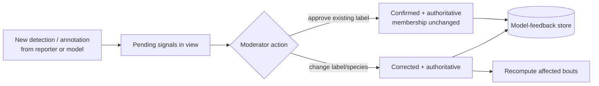
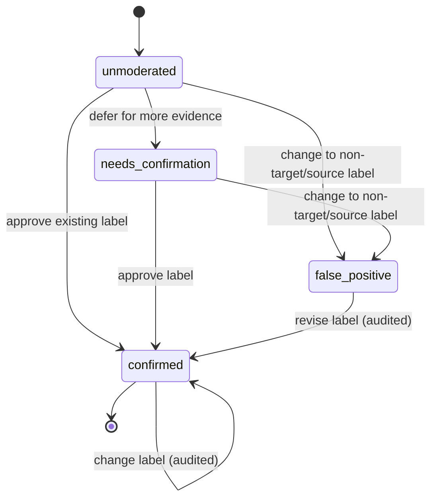

# Moderator Overlay + Realtime Signal Approval — UX Proposal (Draft v0.1)

> Status: **DRAFT / EXPLORATORY** — companion to
> [bout-spec.md](bout-spec.md). This document proposes UX options; it does not
> replace the normative contracts in the bout spec. Where it introduces new data,
> those additions are proposals for §6b.2 of the bout spec.
> Grounded in a 2026-09-16 request to (a) improve the moderator evidence
> **overlay** and (b) add **realtime signal approval** for moderators.

## 1. Purpose & scope

Two related goals:

1. **Evolve the Moderator Workbench overlay.** Today's overlay (bout-spec §8.1)
   pivots almost entirely on *who reported* a signal (human vs model, per-reporter
   lanes). That is necessary but insufficient. Moderators also need to see, at a
   glance:
   - which signals are **already moderated/confirmed** vs still **unverified**;
   - when a single timeframe contains **mixed species that split into two bouts**
     (e.g. a humpback bout and a Biggs/transient bout overlapping in time);
   - when signals **change under them** — a label correction (humpback →
     transient) that can move a bout boundary — both on the bout they are actively
     editing and on bouts they have previously worked.
2. **Add realtime signal approval** — primarily as an inline mode of the M2
  Moderator Workbench overlay, with dedicated queue/compare views retained as
  alternatives (§6). A moderator can review signals outside any bout and confirm
  them against the proposed detection without leaving the overlay. A confirmed
  signal becomes authoritative; later reporter/model input is preserved as a
  separate proposal rather than overwriting it. Whether the API also hard-locks
  confirmed signals is unresolved pending the override policy in U-3. The flow
  is **time-first** (default 1-minute span, zoomable) and supports select → listen
  → tag → approve.

The main overlay is also **pivotable**: a one-tap control flips the same signals
between a *who reported* view (per-reporter lanes) and a *what is here* view
(species/source lanes) — see §4.0.

In v1, selecting, tagging, correcting, confirming, and changing signal labels are
moderator actions integrated into the main overlay (§5). A separate overlay for
non-moderator reporters reviewing non-live data is out of scope; it may be
explored later if a concrete requirement emerges.

Out of scope here: the bout generation algorithm (bout-spec §3–§6), notification
delivery mechanics (bout-spec §9), and storage-engine choice (bout-spec §6b.5).

## 2. Terminology used here (delta over bout-spec §2)

| Term | Meaning in this document |
| ---- | ------------------------ |
| **Signal** | The reviewable unit: a tagged ~3-second **annotation**, or a whole 1-minute **detection** when it has no sub-annotations (consistent with bout-spec §2). |
| **Proposed detection** | The reporter's or model's *unconfirmed* claim about a signal — its interval and tag(s) — before a moderator acts. |
| **Confirmed signal** | A signal a moderator has approved. It is authoritative; reporters and models may submit new proposals but never overwrite the moderator decision. Hard-lock enforcement is an unresolved alternative (U-3). |
| **Moderation state** | Per-signal review status (see §7): `unmoderated`, `confirmed`, `false_positive`, `needs_confirmation`. Distinct from the *bout* `status` in bout-spec §5.2.1, which may be `rejected`. A label change is an audited action, not a persistent moderation state. |
| **Watcher** | A moderator who is working, or previously worked, a bout and should be alerted when its evidence changes (§8). |

## 3. Why the current overlay is not enough

The current overlay

encodes **reporter identity** with lane + color (Reporter A human / Reporter B
model). That answers "who said this?" but not:

- **"Is this signal trustworthy yet?"** — confirmed vs unverified is invisible; a
  moderator can build a bout on evidence that no human has vetted.
- **"Are there really two things here?"** — a minute with both humpback and
  transient calls looks like one busy lane, not two overlapping bouts.
- **"Did something move?"** — if another moderator changes the label on a nearby
  signal, the boundary can shift silently; there is no change signal.

The options below add these three encodings **without** throwing away the
per-reporter view that already works.

> **Rendering convention (matches the live site).** The sonogram always shows the
> sound waveform with bright **bursts** where energy is detected. A signal tag is
> drawn as an **empty outlined rectangle around** its burst — never a solid fill —
> so the waveform stays visible inside the box. Encoding rides on the box's
> *outline and corner glyph* (color = signal type, outline pattern = reporting
> source, corner glyph = moderation state), not on an opaque fill. Two signal
> types in one timeframe are two overlapping boxes.

---

## 4. Moderator overlay — proposed options

Each option is evaluated against the three needs: **(M-state)** show moderation
status, **(Species)** show mixed-species/two-bout overlap, **(Alerts)** show
changes.

### 4.0 Baseline capability — “Who” and “What” as separate, combinable layers

The main interface treats **Who (source)** and **What (species)** as two
*independent layers*, not a single either/or view, because they answer different
questions and routinely co-occur (a vessel *and* residents in the same minute):

- **What · signal type** is drawn as **outline color** — for example humpback,
  transient, vessel, or other/non-target.
- **Who · reporting source** is drawn as the **outline pattern** — solid for human,
  dashed for model, and dotted when source is unknown or unavailable.
- **Moderation state** is drawn as a **corner glyph** — `□` unmoderated, `✓`
  confirmed, `×` false positive, and `?` needs confirmation.

Each layer has its **own on/off control**, and the default shows **both at the same
time**. The swimlane toggle only regroups the same markers by reporting source or
signal type; it never changes these marker encodings.


**The toggle is for the lower bars.** Below the spectrogram, the same signals are
also laid out as grouped **swimlane rows**. A one-tap toggle sets whether those
*lower bars* are grouped **by Who** (per-reporter lanes) or **by What** (species
lanes). The toggle only regroups the lower bars; it does **not** turn off either
upper layer, and it preserves zoom, playback, selection, and the underlying
evidence.

```text
Layers:  [x] What · signal type (color)   [x] Who · source (outline)
Lower bars grouping:  (•) by Who   ( ) by What        ⟵ toggle
```


**Encoding channels (shared vocabulary).** Every §4 option and the moderator
editing controls (§5) reuse the same channel assignment, so the four concerns
never fight over the same visual variable and can be shown simultaneously:

| Concern | Channel |
| ------- | ------- |
| **What** · signal type | **outline color** |
| **Who** · reporting source | **outline pattern** (solid = human, dashed = model, dotted = unknown/unavailable) and/or lane |
| **Moderation state** | **corner glyph** (`□` unmoderated, `✓` confirmed, `×` false positive, `?` needs confirmation) |
| **Change alerts** | **motion** (pulse) + minimap ✦ |

The box interior stays empty so the waveform burst remains visible. A changed
label uses its new signal-type color and current moderation glyph; change history
and review alerts remain in the audit panel/minimap rather than consuming another
marker channel.

Option M3 generalizes the lower-bar grouping to a third choice (group by moderation
state) in addition to Who/What.

### Option M1 — Status fill on toggleable lanes (evolutionary)

Keep the existing Signals overlay, but let moderators toggle its lanes between
**reporting source** and **signal type**. Do not add another per-marker type
indicator: the active lane grouping already communicates that dimension. Add moderation
state as a marker fill, reinforced by the shared corner glyph: neutral/`□`
unmoderated, green/`✓` confirmed, red/`×` false positive, and amber/`?` needs
confirmation. A signal's state fill and glyph persist across regrouping when the
toggle moves it to a different lane.

Keep **change alerts via a pulse + count chip** on markers whose underlying
signal changed since the panel opened.

```text
Group by source
Human  ┤  [□]   [✓]       [?]
Model  ┤    [□]   [×]

Toggle to group by signal type — the same state fills and glyphs move lanes
Humpback  ┤  [□]   [✓]
Transient ┤    [□]   [×]   [?]
```


**Pros**
- Smallest change; reuses muscle memory and existing components.
- Cheapest to build; incremental rollout.

**Cons**
- Only the active grouping is structural; comparing source and signal type at the
  same time requires toggling.
- The two-bout/mixed-species case is still cramped when source lanes are active;
  overlap becomes structural only after switching to signal-type lanes.
- State fill must retain the corner glyph for colorblind accessibility.

Handles: M-state ✔ · Species ~ (weak) · Alerts ✔

### Option M2 — Species-first swimlanes (re-pivot)

Make **species/source** the *default* primary grouping (flip to the reporter pivot
anytime, §4.0). Each species gets its own lane band
(Humpback, Biggs/transient, Vessel, …). Within a band, reporting source remains
the marker's solid/dashed/dotted outline and moderation remains its corner glyph.
Two overlapping bouts render as two clearly separated bands, each with its **own**
boundary handles.

As an optional focus control, add a **Bout limits** selector with **All signal
types** (default) or one signal type/species. Selecting a type shows only that
type's bout boundaries and handles; all overlapping signals and swimlanes remain
visible. This reduces competing boundary lines without hiding evidence or
changing the active signal-type/source swimlane pivot.

```text
 Humpback   ┤  ┌✓┐ ─────────── bout #1 boundary ──────────  │ solid=human
 Transient  ┤        ┌□┐--┌✓┐-- ─ bout #2 boundary ───────  │ dashed=model
 Unassigned ┤   ┌?┐··     (needs signal type)                │ dotted=unknown source
```


#### Option M2-A — Inline signal approval mode (recommended v1)

Add approval directly to the M2 overlay rather than navigating to a separate
console. Selecting one or more proposed markers opens a persistent action bar
below the swimlanes with **Listen**, **Tag**, **Approve**, and **Change label**. The
spectrogram, species lanes, bout boundaries, minimap, and current zoom remain in
place. Signals outside a bout appear in the applicable species lane or
**Unassigned** and can be moderated with the same controls.

Live detections enter the visible time range as unmoderated markers and increment a
pending count without changing the moderator's selection. After an action, the
marker updates in place to the shared corner-glyph styling and the next
unmoderated signal may be selected. Group selection uses the same action bar and
requires an explicit audited revision for any confirmed member (§5.2).

**Pros**
- The mixed-species / two-bout timeframe is **immediately legible** — the split is
  structural, not inferred.
- Overlay aligns with bout identity (species + node + time), so boundaries read
  naturally per species.
- Moderation state is still visible per signal.

**Cons**
- Comparing the *same reporter* across species is harder (reporter is now
  secondary).
- More vertical lanes; an "Unassigned/ambiguous" holding lane is required for
  minutes whose species is not yet determined (ties to bout-spec Appendix A item A).
- Requires a species assignment step before a signal can be placed.

Handles: M-state ✔ · Species ✔ (strong) · Alerts ✔

### Option M3 — Layered canvas with switchable pivot + facet toggles (power tool)

One spectrogram; the §4.0 pivot control is extended to a **third option** —
(Reporter | Species | Moderation state) — and the moderator can toggle facets on/off. Confirmed signals
render with a checkmark. A **minimap ribbon** above the timeline shows signal
density and change markers across the whole session, so alerts are visible even
off-screen.

```text
Pivot: (•)Signal type ( )Source ( )State    Facets: [x]confirmed [x]unmoderated [ ]false positive [x]needs confirmation
minimap ▁▂▅█▅▂▁  ← change ✦ at 08:04 ─────────────────────────────────
[ main spectrogram + overlay rendered per current pivot ]
```

**Pros**
- Most flexible; supports all three needs and future ones (e.g. confidence,
  call-type) by adding facets rather than redesigns.
- Each moderator tunes the view to the task (triage vs boundary work).
- Minimap makes off-screen changes discoverable.

**Cons**
- Highest complexity and build cost; needs excellent defaults or it overwhelms.
- Discoverability/consistency risk (two moderators may see different pivots).
- Harder to document and QA.

Handles: M-state ✔ · Species ✔ · Alerts ✔ (strong)

### Moderator overlay — comparison

| Option | M-state | Species / two-bout | Alerts | Build cost | Overload risk |
| ------ | :-----: | :----------------: | :----: | :--------: | :-----------: |
| M1 evolutionary | Good | Weak | Good | Low | High |
| M2 species-first | Good | **Strong** | Good | Medium | Medium |
| M3 layered/switchable | Good | Strong | **Strong** | High | Medium‑High |

**Recommendation:** ship **M2 as the default overlay** (it directly solves the
mixed-species/two-bout requirement), and adopt **M3's minimap ribbon** as the
alert mechanism layered on top. Keep M1's **corner-glyph vocabulary** as the
shared moderation-state language across every
moderator view.

---

## 5. Moderator signal editing in the overlay (v1)

Signal editing is part of the Moderator Workbench overlay in §4, not a separate
surface. A moderator stays in the same time-aligned spectrogram and species/source
lanes while inspecting, selecting, listening to, tagging, confirming, or changing
signal labels. The current pivot, zoom, playback position, and bout
boundaries remain visible throughout the action.

### 5.1 Single-signal editing

A moderator selects a signal box or its aligned lane marker. The details panel
shows the current and proposed tags, reporter/model provenance, confidence,
moderation state, audio interval, and review history. The moderator can **Listen**,
**Confirm** or **Change labels** without leaving the overlay. Confirmed
decisions are authoritative; subsequent corrections use an explicit audited
moderator action (§7).

### 5.2 Group selection and tagging

Moderators can rubber-band a time range, Shift-click signals, use a checkbox list,
or choose **Select all in view**. A selection summary shows the count, time span,
current tags, and moderation states. **Listen to selection** plays only those
intervals, and **Change selection** applies one tag-set edit to the whole group.
Already-confirmed members are identified before confirmation and require an
explicit audited revision; no member is silently skipped.

This interaction supports the worked existing-bout corrections in §8.1–§8.2 and
the realtime approval options in §6. On phone, the same controls use the stacked
Workbench layout and sticky moderator action bar described in bout-spec §8.2.

Non-moderator tagging or correction of historical/non-live signals is not a v1
requirement. Reporters and models continue to supply source evidence through the
existing ingestion paths; a future reporter-facing review experience requires a
separate product decision.

---

## 6. Realtime Signal Approval options (moderator-only)

The recommended v1 option is **M2-A**, the inline approval mode in §4. It supports
the core **see → select → listen → tag/approve** loop without a separate console
or workflow. The dedicated concepts below remain alternatives for unusually large
backlogs or focused reconciliation. In every option, confirmation makes the
moderator decision authoritative (§7); it does not imply an exclusive hard lock.
The default span is **1 minute**, zoomable out to hours or in to seconds.


### Shared requirements (all options)

- **Time axis with zoom:** default 1-min window; zoom presets 10 s / 1 min /
  15 min / 1 h; horizontal scrub with audio kept in sync.
- **Select:** one signal, a rubber-band range, a checkbox list, or "all pending in
  view."
- **Multi-select approve (first-class):** a single **Approve** or **Change label**
  applies to the **entire selection** in one action, with a
  keyboard/gesture shortcut for "approve all in view." Already-confirmed signals
  are listed separately and require an explicit audited moderator revision; they
  are never silently skipped. This is the primary throughput lever and MUST be
  available in every option and on phone.
- **Listen:** scoped playback of the selected signal/region (or sequential
  playback across a multi-selection).
- **Tag/approve:** approve as-is or change the label/species; the chosen label
  applies to the whole selection. False positives are corrected to the appropriate
  non-target/source label. Edits write to the main database (§7), not a side store.
- **Authority on confirm:** reporter/model ingestion creates separate proposals
  and may not overwrite a confirmed decision. A moderator may revise it through
  an explicit audited action. Hard-lock enforcement remains an alternative in U-3.
- **Live intake:** newly arriving detections stream into the "pending" set in near
  real time.
- **Encoding is unchanged from §4.0:** outline color encodes signal type,
  solid/dashed/dotted outline encodes reporting source, and the corner glyph
  encodes moderation state. The same marker therefore reads identically in the
  overlay, dedicated alternatives, and phone layout.

### Option S1 — Time-rail triage inbox (list-centric)

Left: chronological, keyboard-navigable list of pending signals bucketed by minute.
Right: detail pane with 1-min spectrogram, audio, tag editor, and
Approve / Change label. Optimized for **backlog throughput**.

**Pros**
- Fastest per-item throughput; familiar inbox pattern; excellent keyboard flow.
- Great for clearing historical backlog (KPI 2).

**Cons**
- Weak spatial/temporal context; clustering and overlaps are hard to see.
- Zoom is per-item, not continuous.

### Option S2 — Continuous timeline scrubber (timeline-centric) — recommended

A horizontally scrolling spectrogram at 1-min default zoom; signals are selectable
blocks. Select one/many → listen → tag → approve inline. Zoom changes the span.
Confirmed blocks show a checkmark and remain authoritative when later
reporter/model proposals arrive.

```text
[◀ 08:03 ──────── 08:04 ──────── 08:05 ▶]   zoom: 10s · [1m] · 15m · 1h
spectrogram ░▒▓ signals: ┌□┐unmoderated  ┌✓┐confirmed  ┌×┐false positive  ┌?┐needs confirmation
select ▢▢  →  ( Listen )  ( Label: transient ▾ )  ( Approve )  ( Change label )
```


**Pros**
- Directly matches the "**view by time, default 1 minute, zoomable**" ask.
- Strong temporal context; batch-approve consecutive signals; overlaps visible.
- Same timeline/audio/spectrogram components as the Workbench (reuse).

**Cons**
- Per-item approval can be slower than S1 for a huge undifferentiated backlog.
- Needs a good multi-select and "approve selection" affordance.

### Option S3 — Proposed-vs-confirmed compare view (reconciliation)

Two aligned tracks: **model-proposed** detections above, **human-proposed** below;
the moderator confirms the correct interpretation or writes a corrected tag.
Emphasis on reconciling *proposed detection* against the signal.

**Pros**
- Best for disagreements and for generating clean **model-eval / retraining**
  labels (§9).
- Makes the "confirm against proposed detection" intent explicit.

**Cons**
- Narrower use; heavier UI; overkill for simple, uncontested confirmations.

### Approval console — comparison

| Option | Time-first / zoom | Throughput | Context | Model-feedback value | Build cost |
| ------ | :---------------: | :--------: | :-----: | :------------------: | :--------: |
| M2-A inline approval | **Strong** | Medium-High | **Highest** | Medium | Low-Med |
| S1 triage inbox | Partial | **High** | Low | Medium | Low‑Med |
| S2 timeline scrubber | **Strong** | Medium‑High | **High** | Medium | Medium |
| S3 compare view | Strong | Medium | High | **High** | High |

**Recommendation:** build **M2-A as the primary v1 approval workflow** within the
Moderator Workbench. Consider **S1** later for backlog blitzes and **S3** for
focused reconciliation; S2 is the dedicated-surface alternative if inline M2
cannot meet throughput needs. Every option writes through the same review API.

### Responsive phone view (all options)

The approval workflow has a phone layout so moderators can clear pending signals
away from a desk. For M2-A this is the Workbench's stacked mobile layout, not a
separate destination. It is not a shrunk desktop grid; it is a single vertical
flow that keeps the same review contract.


1. A compact header shows node, "live" state, and the pending count.
2. Zoom presets (10 s / **1 min** / 15 min / 1 h) sit above a pinch-zoomable,
   scrubbable spectrogram; tapping a block selects it.
3. **Multi-select is first-class on phone:** tap blocks, drag a marquee, use the
   checkbox list, or "Select all in view." A selection summary shows the count and
   time span.
4. **Listen** plays the selection (scoped or sequential); a single **Tag** applies
   to all selected.
5. A **sticky bottom bar** exposes **Approve all (N)** and **Change label**;
  either action confirms the whole selection; confirmed members require an
  explicit audited revision and are never silently skipped.
6. Live intake updates the pending badge without losing the current selection,
   zoom, or playback position.

Minimum target 390 CSS-pixel viewport; controls ≥ 44×44 CSS px; horizontal
scrolling limited to the time-aligned spectrogram. Desktop and phone operate on the
same signals and server state (mirrors bout-spec §8.2).

### Approval flow



---

## 7. Proposed data-model additions

These extend the canonical relational model in **bout-spec §6b.2**. All additions
are UTC, append-only where they carry decisions, and preserve provenance.

### 7.1 Per-signal moderation state

Add an explicit, queryable state to the reviewable unit (annotation, or detection
when it has no annotations). Prefer a dedicated column plus an append-only review
history over a mutable flag.

| Field | Table | Type | Purpose |
| ----- | ----- | ---- | ------- |
| `moderation_state` | `annotations` (and `detections` for annotation-less minutes) | enum | `unmoderated` \| `confirmed` \| `false_positive` \| `needs_confirmation`. Drives the corner glyph. Label corrections remain append-only `signal_reviews` actions rather than a display state. |
| `signal_confirmed_tags` | new join table | rows | `{signal_ref, tag_id, confirmed_by, confirmed_at}`. The authoritative set of tags a moderator affirmed; supports multiple simultaneous species/sources on one signal without duplicating its parent detection. |
| `confirmed_by` | same | FK → user | Moderator who confirmed/changed it. |
| `confirmed_at` | same | timestamptz | When it was confirmed/changed. |

`signal_reviews` (append-only, mirrors `detection_reviews`): `{id, signal_ref,
prior_state, new_state, prior_tag_ids[], new_tag_ids[], actor, at, comment}`. The
current state and authoritative tag set come from the newest review and its
`signal_confirmed_tags` rows; history is never mutated.

> A confirmed signal is not restricted to one species/source. For example, an
> annotation-less minute may be authoritatively tagged with both `srkw` and
> `vessel` and contribute to two overlapping bouts. A correction replaces the
> applicable member of the confirmed tag set rather than overwriting the whole
> set (for example, `{orca, vessel}` → `{seal, vessel}`).

> The bout-spec already has `detection_reviews` (`unreviewed|confirmed|
> false_positive|unknown`). This proposal **refines that to the signal level**.
> Reconcile during migration: `confirmed`→`confirmed`, `unreviewed`→
> `unmoderated`, `false_positive`→`false_positive`, and `unknown`→
> `needs_confirmation` (see open issue U-6). A false positive still carries the
> appropriate non-target/source label for training and provenance.

> **Moderator editing and confirmed authority (§5).** A moderator confirmation or
> correction writes `signal_reviews` and the corresponding
> `signal_confirmed_tags`; it never rewrites source evidence from a reporter or
> model. Group edits create one auditable review per selected signal. A stronger
> API hard lock is not part of this baseline; see U-3.

### 7.2 Species assignment & multi-bout membership (for the species-first overlay)

| Field | Table | Type | Purpose |
| ----- | ----- | ---- | ------- |
| Species/source lanes | derived from `signal_confirmed_tags` (or proposed tags before confirmation) | projection | A signal appears in every applicable species/source lane (Option M2); a signal with no applicable tag renders in "Unassigned." This is not a singular stored field. |
| `signal_bout_membership` | new join table | rows | `{signal_ref, bout_id, role}` — lets one minute's signals belong to **multiple** overlapping bouts without duplication (bout-spec §3 detection-vs-bout note, Appendix A item A). |

### 7.3 Change tracking & watchers (for alerts)

| Field / table | Type | Purpose |
| ------------- | ---- | ------- |
| `change_events` (new) | rows | `{id, entity_type: bout\|signal, entity_id, change_type, from, to, actor, at, affected_bout_ids[]}`. One row per label or bout change that may affect bout membership; drives change alerts. Signal confirmation is audited in `signal_reviews` but does not trigger bout recomputation. |
| `bout_watch` (new) | rows | `{bout_id, user_id, reason: working\|worked, created_at}`. Populated when a moderator claims/edits a bout, and retained after publish so prior reviewers can be alerted later. |

### 7.4 Model-feedback fields

| Field / table | Type | Purpose |
| ------------- | ---- | ------- |
| `model_feedback` (new) | rows | `{id, signal_ref, model_reporter_id, model_label, model_confidence, moderator_label, decision: approve\|change, at, export_state}`. The clean supervised signal for retraining/eval (§9); a false positive is represented by `change` plus the moderator's non-target/source label. |
| `export_state` | `model_feedback` | enum | `pending` \| `exported` \| `excluded`. Lets ambiguous/unknown items be withheld from training. |

---

## 8. Change propagation & alerts

Confirming a signal approves its existing label. It does **not** change the
signal's bout membership or boundaries, and therefore never merges or grows a
bout. A label change can affect bouts in either direction:

- **Change the label on a signal** that anchored a boundary to a label outside the
  bout's species/source → a 15-min gap may open → a bout may **split** or **shrink**.
- **Change the label on a signal from another bout/source to the label for this
  bout** → the signal joins this bout; it may fill a former gap so two bouts
  **merge**, or extend the nearest boundary so the bout **grows**.
- **Change species** (humpback → transient) → the signal leaves one species bout
  and joins another; **both** bouts' boundaries may move.

Design:

1. Every label change that alters bout membership writes a `change_events` row
  with `affected_bout_ids`. Confirmation still writes its normal audit and model-
  feedback records, but creates no bout-boundary change.
2. Before Save is enabled, the generator computes the complete resulting set of
  candidate and published bouts, including membership, boundaries, type, tags,
  and any split or merge. The UI previews those results alongside the label
  change. If the result cannot satisfy the bout timeframe invariant, Save remains
  disabled; the moderator cannot create an intermediate illegal state.
3. Saving commits the signal review, membership changes, recomputed bouts, and
  `change_events` audit rows in one transaction. No intermediate boundary state
  is persisted. Updating an already-published bout is audited but does not send a
  subscriber notification or publish a candidate.
4. **Active editors** of an affected bout see an inline banner ("Evidence changed
  — boundary updated") with optimistic-concurrency handling and a before/after
  diff.
5. **Watchers** (`bout_watch.reason = worked`) get an inbox/notification badge:
   "A bout you reviewed changed," linking to a diff of before/after.

### 8.1 Existing-bout correction: orca signal → seal

A reviewer opens an existing orca bout from the Bouts page or from an "A bout you
reviewed changed" alert. The Workbench opens in **review existing bout** mode and
keeps the bout boundary visible while the species overlay shows each member
signal. The reviewer selects the misidentified orca signal and listens to its
exact interval; the details panel shows its current `orca` identification,
reporter/model provenance, confidence, moderation state, and review history.

The reviewer chooses **Change**, selects `seal`, and sees an inline preview before
confirming:

- the signal moves from the orca lane to the seal lane;
- the signal leaves the orca bout and joins or seeds the applicable seal bout (potentially resulting in merging two existing seal bouts);
- every affected bout is listed with its current and resulting boundaries; and
- any title, type, tag, split, or merge consequence is called out explicitly.

Confirming writes a `signal_reviews` entry (`orca` → `seal`), keeps the signal
authoritative while later reporter/model input remains separate, records model
feedback, updates every affected bout to the previewed valid result, and emits one
`change_events` row naming those bouts in the same transaction. There is no second
boundary-acceptance step. Correcting the signal does not publish a candidate bout
or notify subscribers (see U-7).

### 8.2 Existing-bout correction: unidentified opening signals → ship

A reviewer opens an existing bout and zooms to the small unidentified signals at
its beginning. They drag a marquee over the run, then add or remove individual
signals by Shift-click on desktop or checkboxes on phone. The selection summary
shows the count, total time span, current tags and moderation states. **Listen to
selection** plays the intervals in sequence so the reviewer can verify that the
whole group has the same ship source before changing it.

The reviewer chooses **Change selection**, identifies the source as **ship**
(canonical tag `vessel`), and receives one confirmation screen for the batch. The
screen lists every signal that will change and flags any item that cannot be
revised under the moderator-override policy (U-3); an ineligible item is never
silently skipped. The preview moves the selected signals into a vessel lane and
shows the resulting anthrophony/vessel bout. If those signals anchored the
original bout's start, it also shows that boundary moving to the first remaining
signal and displays both bouts before and after the change.

Confirming creates one append-only `signal_reviews` record per selected signal,
corresponding `change_events` and model-feedback records, and an audit link that
groups them as one batch action. The same transaction updates every affected
candidate or published bout to its previewed valid state. If any result cannot be
validated, none of the batch is saved. The update never publishes a candidate
bout or sends a subscriber notification.



---

## 9. Recent high-value bouts

Moderators need a quick way to revisit strong examples so they can calibrate what
clear, useful signals look and sound like. Add a **Recent bouts** view that uses
the same bout cards, timeline, audio player, and species/source overlays as the
Workbench. It is a review and learning surface, not another moderation queue.

### 9.1 Ranking and filters

The default **High value first** order is deterministic and transparent:

1. Bouts carrying the moderator-assigned `high-value` tag appear first.
2. Within the high-value group, bouts are ordered newest first.
3. Remaining bouts follow, also newest first.

Model confidence does not automatically make a bout high value and is not folded
into a hidden quality score. Moderators can switch to **Newest first** and filter
by node, species/source, date, moderator, and `high-value` status. Each result
shows the bout title, node, time, tags, contributing signal count, reviewer, and a
compact spectrogram with a play action.

### 9.2 Mark high value while reviewing

While creating or updating a bout, a moderator can toggle a star action labeled
**High Value** in the bout details panel. Turning it on adds the canonical
`high-value` bout tag; turning it off removes that tag. The change autosaves with
the other bout metadata and appends `{who, when, field: tags, from, to}` to the
bout's `review_history`. Reporters and models may see the tag but cannot set or
remove it.

The control includes a short optional note for why the example is valuable, such
as clear signal-to-noise ratio, representative call type, unusual species, or a
useful correction example. The note is displayed in the Recent bouts view but is
not part of ranking. Applying or removing `high-value` does not publish the bout
or notify subscribers.


### 9.3 Sample recent-bouts view


Selecting a row opens the existing bout in read-only review mode by default.
Moderators can choose **Edit bout** to enter the correction workflow in §8.1–§8.2,
while other viewers can inspect and play the confirmed signals without changing
them.


## 10. Open issues

Add these to bout-spec **Appendix A** if adopted.

| ID | Open question | Why it matters / proposed direction |
| -- | ------------- | ----------------------------------- |
| U-1 | **Atomic recompute failure handling:** if the system cannot compute a valid post-change bout set, what recovery detail should the moderator see? | Direction decided: preview the automatic result and disable Save until the label change and all affected bouts can commit atomically. Confirmation alone never changes a boundary. Open detail: error/retry presentation. |
| U-2 | **Bout identity across split/merge:** if a label change splits one bout into two or merges two bouts, are IDs preserved, retired, or lineage-linked? | Affects notifications, `coincident_with`, and audit. Proposed: retire+link via a `derived_from` lineage field. |
| U-3 | **Confirmed-signal write policy:** is append-only authority sufficient (reporter/model input becomes a separate proposal and moderators revise through audited actions), or should the API additionally hard-lock confirmed records? If hard locking is adopted, who may override it and with what precedence? | The baseline in this proposal uses append-only authority to match the bout spec's guidance to avoid hard locking. A padlock/`locked` field MUST NOT be implemented unless stakeholders choose the stronger alternative and define moderator override, takeover, and audit behavior. |
| U-4 | **What is fed back to models, and when?** confirmed labels, corrected labels (including humpback↔transient and false-positive→non-target/source), and boundary-adjacent negatives — in what format and cadence, and how are `unknown`/ambiguous items excluded? | Drives retraining quality (KPI 3). Proposed: export `model_feedback` where `export_state = pending` and decision ∈ {approve, change}; withhold `unknown`. |
| U-5 | **Realtime intake latency & backpressure:** how "live" is the approval queue, and what happens under bursts (many nodes, model re-runs)? | Determines whether S2's live intake is truly realtime or near-realtime; affects infra (bout-spec Appendix A item T). |
| U-6 | **`unknown` / `SRKWFound` semantics:** how does signal-level `unknown` map to the bout spec's `SRKWFound` scope question (Appendix A item C)? | A signal changed from SRKW may still be valid *other-species* or source evidence; the replacement label must identify what is present. |
| U-7 | **Does approving a signal outside a bout ever notify subscribers,** or is notification still exclusively a bout-publish action (bout-spec §9)? | Prevents double-notification and keeps the publish gate authoritative. Proposed: approval never notifies; only bout publish does. |

## 11. Recommendation summary

- **Moderator overlay:** make the **Reporter ⇄ Species pivot toggle** (§4.0) a
  baseline control in the main interface; default to the **species pivot / M2
  (species-first swimlanes)** to solve the mixed-species / two-bout requirement,
  layered with **M3's minimap** for change alerts; adopt a single moderation-state
  vocabulary (✓/hatch/amber/strike) shared everywhere.
- **Moderator editing:** integrate single-signal and group tagging directly into
  the §4 overlay; preserve timeline context and require audited revisions for
  confirmed signals. A separate non-moderator historical-data overlay is out of
  scope for v1.
- **Realtime approval:** build **M2-A inline approval** in the main species-first
  overlay as the primary v1 workflow: time-first, 1-min default, zoomable,
  select/listen/tag/approve, **first-class multi-select approve**, authoritative
  confirmation, and a responsive phone layout with a sticky Approve-all / Change
  label bar. Keep S1–S3 as optional specialized views, not required navigation.
- **Data:** add per-signal `moderation_state` + confirmation fields, the
  many-to-many `signal_confirmed_tags` relation, `signal_bout_membership`,
  `change_events`, `bout_watch`, and `model_feedback`, extending bout-spec §6b.2;
  do not add a `locked` field unless U-3 resolves in favor of hard enforcement.
- **Loop safety:** preview label-change effects, then atomically update all
  affected bouts so the timeframe invariant always holds; alert active editors
  and prior watchers, and feed a clean supervised set back to models.
- **Quality calibration:** add a Recent bouts view ordered by moderator-assigned
  `high-value` first, with newest-first ordering inside each group and no opaque
  confidence-derived quality score.
