# Moderator Overlay + Post-bout Annotation Tagging — UX Proposal (Draft v0.2)

> Status: **DRAFT / EXPLORATORY** — companion to
> [bout-spec.md](bout-spec.md). This document proposes UX options; it does not
> replace the normative contracts in the bout spec. Where it introduces new data,
> those additions are proposals for §6b.2 of the bout spec.
> Grounded in a 2026-09-16 request to (a) improve the moderator evidence
> **overlay** and (b) add **post-bout annotation tagging** for moderators.

## 1. Purpose & scope

Two related goals:

1. **Evolve the Moderator Workbench overlay.** Today's overlay (bout-spec §8.1)
  pivots almost entirely on *who reported* an annotation (human vs model, per-reporter
   lanes). That is necessary but insufficient. Moderators also need to see, at a
   glance:
  - which annotations are **already moderated/confirmed** vs still **unverified**;
   - when a single timeframe contains **mixed species that split into two bouts**
     (e.g. a humpback bout and a Biggs/transient bout overlapping in time);
  - when annotations **change under them** — a label correction (humpback →
     transient) that can move a bout boundary — both on the bout they are actively
     editing and on bouts they have previously worked.
2. **Add post-bout annotation tagging alongside bout approval** — primarily as
  an inline mode of the M2
  Moderator Workbench overlay, with dedicated queue/compare views retained as
  alternatives (§6). As soon as a bout begins, a moderator can open it and tag or
  correct its approximately 3-second annotations, including
  annotations not yet assigned to a species/source bout, without leaving the
  overlay; final approval remains available once the bout is closed. A confirmed annotation becomes authoritative; later reporter/model input is
  preserved as a separate proposal rather than overwriting it. Whether the API
  also hard-locks confirmed annotations is unresolved pending the override policy in
  U-3. The flow is **time-first** (default 2-minute contextual viewing span, zoomable) and
  supports select annotation → listen → tag/confirm, followed by bout approval.
  One-minute detections remain ingestion and boundary evidence; moderators never
  approve or tag a 60-second detection as a review unit.

The main overlay is also **pivotable**: a one-tap control flips the same annotation markers
between a *who reported* view (per-reporter lanes) and a *what is here* view
(species/source lanes) — see §4.0.

In v1, selecting, tagging, correcting, confirming, and changing annotation labels are
moderator actions integrated into the main overlay (§5). A separate overlay for
non-moderator reporters reviewing non-live data is out of scope; it may be
explored later if a concrete requirement emerges.

Out of scope here: the bout generation algorithm (bout-spec §3–§6), notification
delivery mechanics (bout-spec §9), and storage-engine choice (bout-spec §6b.5).

## 2. Terminology used here (delta over bout-spec §2)

| Term | Meaning in this document |
| ---- | ------------------------ |
| **Annotation** | The only fine-grained interval shown for moderator tagging: an approximately 3-second interval with proposed or confirmed label(s). One-minute detections may inform bout boundaries in the backend but are not displayed in the moderator UI. |
| **Proposed annotation** | A reporter's or model's unconfirmed approximately 3-second interval and tag(s) before a moderator acts. |
| **Confirmed annotation** | An annotation whose tag(s) a moderator has confirmed. It is authoritative; reporters and models may submit new proposals but never overwrite the moderator decision. Hard-lock enforcement is an unresolved alternative (U-3). |
| **Moderation state** | Per-annotation review status (see §7): `unmoderated`, `confirmed`, `false_positive`, `needs_confirmation`. Distinct from the *bout* `status` in bout-spec §5.2.1, which may be `rejected`. A label change is an audited action, not a persistent moderation state. |
| **Bout approval** | The moderator decision on the completed bout. It is separate from tagging or confirming the bout's approximately 3-second annotations. |
| **Watcher** | A moderator who is working, or previously worked, a bout and should be alerted when its evidence changes (§8). |

## 3. Why the current overlay is not enough

The currently proposed overlay
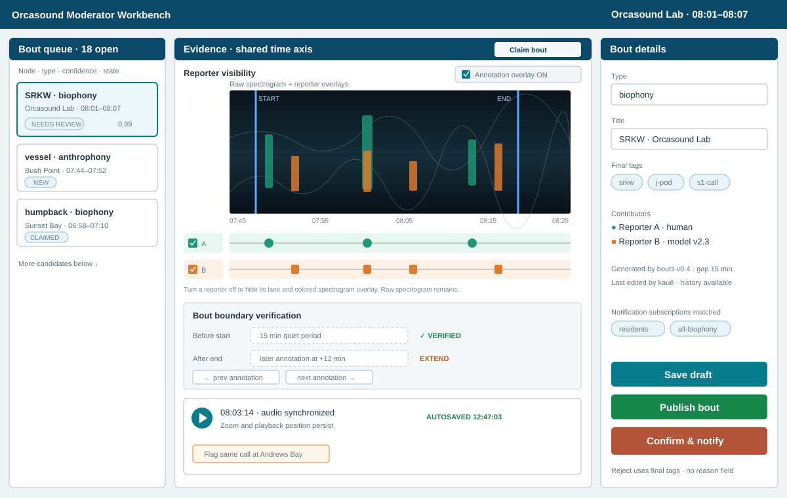
encodes **reporter identity** with lane + color (Reporter A human / Reporter B
model). That answers "who said this?" but not:

- **"Is this annotation trustworthy yet?"** — confirmed vs unverified is invisible; a
  moderator can build a bout on evidence that no human has vetted.
- **"Are there really two things here?"** — a minute with both humpback and
  transient calls looks like one busy lane, not two overlapping bouts.
- **"Did something move?"** — if another moderator changes the label on a nearby
  annotation, the boundary can shift silently; there is no change alert.

The options below add these three encodings **without** throwing away the
per-reporter view that already works.

> **Baseline rendering convention (matches the live site).** The sonogram always shows the
> sound waveform with bright **bursts** where energy is detected. An annotation is
> drawn as an **empty outlined rectangle around** its burst — never a solid fill —
> so the waveform stays visible inside the box. Encoding rides on the box's
> *outline and corner glyph* (color = annotation label, outline pattern = reporting
> source, corner glyph = moderation state), not on an opaque fill. Two annotation
> labels in one timeframe are two overlapping boxes. M1 intentionally tests a
> state-fill alternative only in the lower swimlane markers; spectrogram boxes
> remain translucent enough to preserve waveform visibility.

---

## 4. Moderator overlay — proposed options

Each option is evaluated against the three needs: **(M-state)** show moderation
status, **(Species)** show mixed-species/two-bout overlap, **(Alerts)** show
changes.

### 4.0 Baseline capability — “Who” and “What” as separate, combinable layers

The main interface treats **Who (source)** and **What (species)** as two
*independent layers*, not a single either/or view, because they answer different
questions and routinely co-occur (a vessel *and* residents in the same minute):

- **What · annotation label** is drawn as **outline color** — for example humpback,
  transient, vessel, or other/non-target.
- **Who · reporting source** is drawn as the **outline pattern** — solid for human,
  dashed for model, and dotted when source is unknown or unavailable.
- **Moderation state** is drawn as a **corner glyph** — `□` unmoderated, `✓`
  confirmed, `×` false positive, and `?` needs confirmation.

Each layer has its **own on/off control**, and the default shows **both at the same
time**. The swimlane toggle only regroups the same markers by reporting source or
annotation label; it never changes these marker encodings.

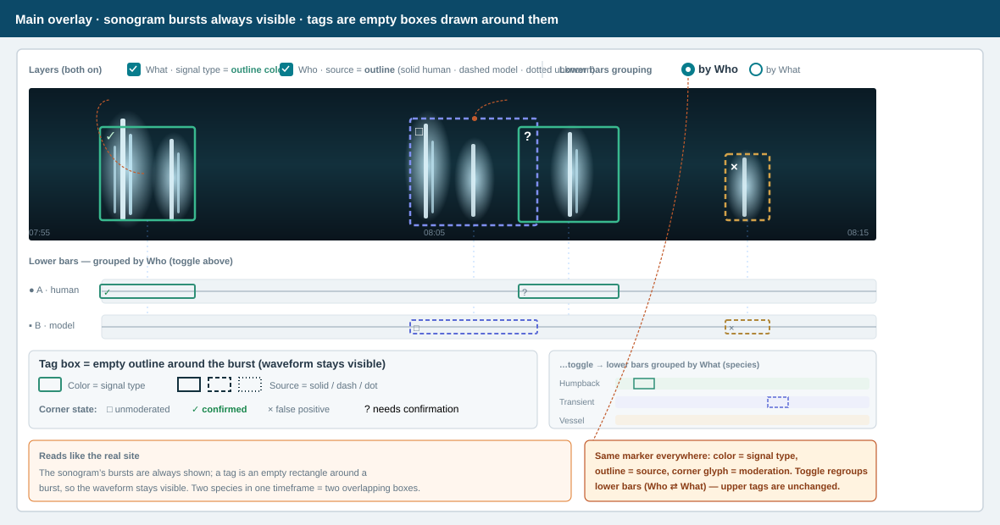

**The toggle is for the lower bars.** Below the spectrogram, the same annotation markers are
also laid out as grouped **swimlane rows**. A one-tap toggle sets whether those
*lower bars* are grouped **by Who** (per-reporter lanes) or **by What** (species
lanes). The toggle only regroups the lower bars; it does **not** turn off either
upper layer, and it preserves zoom, playback, selection, and the underlying
evidence.

```text
Layers:  [x] What · annotation label (color)   [x] Who · source (outline)
Lower bars grouping:  (•) by Who   ( ) by What        ⟵ toggle
```

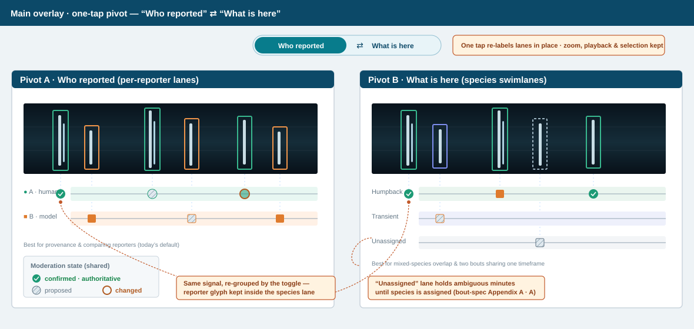

**Encoding channels (shared baseline vocabulary).** M2, M3, and the moderator
editing controls (§5) reuse this channel assignment, so the four concerns never
fight over the same visual variable and can be shown simultaneously. M1 is the
explicit alternative that moves source/type into the lane grouping and adds
state fill while retaining the same corner glyphs.

| Concern | Channel |
| ------- | ------- |
| **What** · annotation label | **outline color** |
| **Who** · reporting source | **outline pattern** (solid = human, dashed = model, dotted = unknown/unavailable) and/or lane |
| **Moderation state** | **corner glyph** (`□` unmoderated, `✓` confirmed, `×` false positive, `?` needs confirmation) |
| **Change alerts** | **motion** (pulse) + minimap ✦ |

The box interior stays empty so the waveform burst remains visible. A changed
label uses its new annotation-label color and current moderation glyph; change history
and review alerts remain in the audit panel/minimap rather than consuming another
marker channel.

Option M3 generalizes the lower-bar grouping to a third choice (group by moderation
state) in addition to Who/What.

### Option M1 — Status fill on toggleable lanes (evolutionary)

This option intentionally departs from the §4.0 outline-only baseline for lower
swimlane markers. Its fill is supplemental; the corner glyph remains the
portable moderation-state encoding shared with every other view.

Keep the existing annotation overlay, but let moderators toggle its lanes between
**reporting source** and **annotation label**. Do not add another per-marker label
indicator: the active lane grouping already communicates that dimension. Add moderation
state as a marker fill, reinforced by the shared corner glyph: neutral/`□`
unmoderated, green/`✓` confirmed, red/`×` false positive, and amber/`?` needs
confirmation. An annotation's state fill and glyph persist across regrouping when the
toggle moves it to a different lane.

Keep **change alerts via a pulse + count chip** on markers whose underlying
annotation changed since the panel opened.

```text
Group by source
Human  ┤  [□]   [✓]       [?]
Model  ┤    [□]   [×]

Toggle to group by annotation label — the same state fills and glyphs move lanes
Humpback  ┤  [□]   [✓]
Transient ┤    [□]   [×]   [?]
```

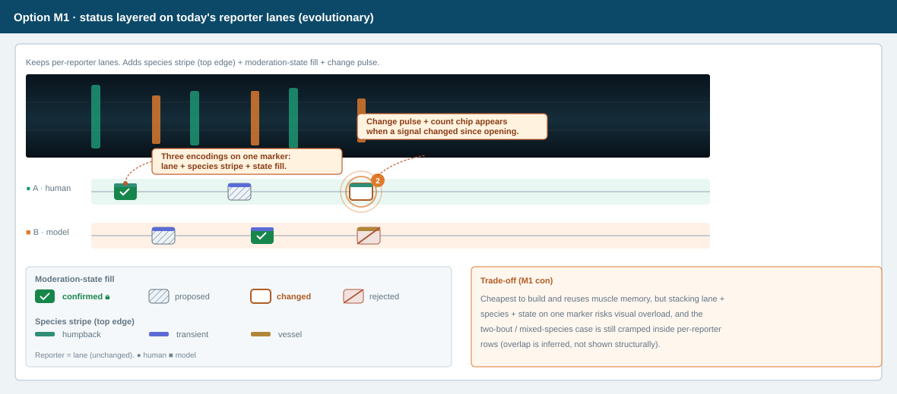

**Pros**
- Smallest change; reuses muscle memory and existing components.
- Cheapest to build; incremental rollout.

**Cons**
- Only the active grouping is structural; comparing source and annotation label at the
  same time requires toggling.
- The two-bout/mixed-species case is still cramped when source lanes are active;
  overlap becomes structural only after switching to annotation-label lanes.
- State fill must retain the corner glyph for colorblind accessibility.

Handles: M-state ✔ · Species ~ (weak) · Alerts ✔

### Option M2 — Species-first swimlanes (re-pivot)

Make **species/source** the *default* primary grouping (flip to the reporter pivot
anytime, §4.0). Each species gets its own lane band
(Humpback, Biggs/transient, Vessel, …). Within a band, reporting source remains
the marker's solid/dashed/dotted outline and moderation remains its corner glyph.
Two overlapping bouts render as two clearly separated bands, each with its **own**
boundary handles.

As an optional focus control, add a **Bout limits** selector with **All annotation
labels** (default) or one annotation label/species. Selecting a label shows only that
label's bout boundaries and handles; all overlapping annotations and swimlanes remain
visible. This reduces competing boundary lines without hiding evidence or
changing the active annotation-label/source swimlane pivot.

```text
 Humpback   ┤  ┌✓┐ ─────────── bout #1 boundary ──────────  │ solid=human
 Transient  ┤        ┌□┐--┌✓┐-- ─ bout #2 boundary ───────  │ dashed=model
 Unassigned ┤   ┌?┐··     (needs annotation label)           │ dotted=unknown source
```

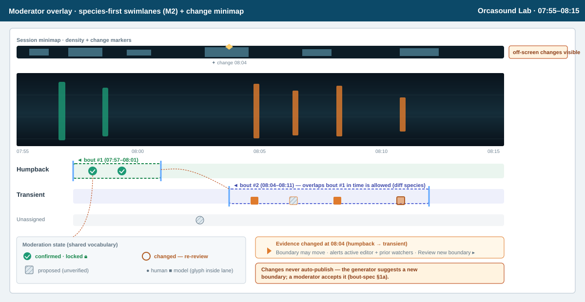

#### Option M2-A — Inline annotation tagging mode (recommended v1)

Add annotation tagging directly to the M2 overlay rather than navigating to a
separate console. Selecting one or more proposed annotation markers opens a
persistent action bar below the swimlanes with **Listen**, **Tag**, **Confirm
tags**, and **Change labels**. The
spectrogram, species lanes, bout boundaries, minimap, and current zoom remain in
place. Annotations without a species/source assignment appear in **Unassigned**
and can be tagged with the same controls. **Approve bout** remains a separate bout
action after annotation review; none of these controls approves a 1-minute
detection.

The active bout is available for review as soon as qualifying activity is detected. It enters the closed-bout review queue only after the automatic 15-minute
no-detection gap closes and the bout is logged; closure controls queue intake, not initial evidence access.
After an action, the marker updates in place to the shared corner-glyph styling
and the next unmoderated annotation may be selected. Group selection uses the same
action bar and requires an explicit audited revision for any confirmed member
(§5.2).

**Pros**
- The mixed-species / two-bout timeframe is **immediately legible** — the split is
  structural, not inferred.
- Overlay aligns with bout identity (species + node + time), so boundaries read
  naturally per species.
- Moderation state is still visible per annotation.

**Cons**
- Comparing the *same reporter* across species is harder (reporter is now
  secondary).
- More vertical lanes; an "Unassigned/ambiguous" holding lane is required for
  annotations whose species is not yet determined (ties to bout-spec Appendix A item A).
- Requires a species assignment step before an annotation can be placed.

Handles: M-state ✔ · Species ✔ (strong) · Alerts ✔

### Option M3 — Layered canvas with switchable pivot + facet toggles (power tool)

One spectrogram; the §4.0 pivot control is extended to a **third option** —
(Reporter | Species | Moderation state) — and the moderator can toggle facets on/off. Confirmed annotations
render with a checkmark. A **minimap ribbon** above the timeline shows annotation
density and change markers across the whole session, so alerts are visible even
off-screen.

```text
Pivot: (•)Annotation label ( )Source ( )State    Facets: [x]confirmed [x]unmoderated [ ]false positive [x]needs confirmation
minimap ▁▂▅█▅▂▁  ← change ✦ at 08:04 ─────────────────────────────────
[ main spectrogram + overlay rendered per current pivot ]
```
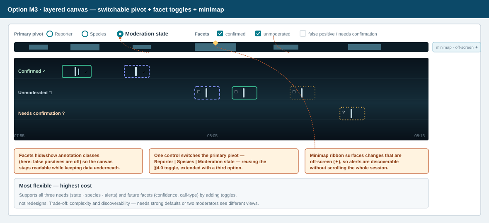
**Pros**
- Most flexible; supports all three needs and future ones (e.g. confidence,
  call-type) by adding facets rather than redesigns.
- Each moderator tunes the view to the task (triage vs boundary work).
- Minimap makes off-screen changes discoverable.

**Cons**
- Highest complexity and build cost; needs excellent defaults or it overwhelms.
- Discoverability/consistency risk (two moderators may see different pivots).
- Harder to document and QA.

Handles: M-state ✔ · Species ✔ · Alerts ✔ (strong)

### Moderator overlay — comparison

| Option | M-state | Species / two-bout | Alerts | Build cost | Overload risk |
| ------ | :-----: | :----------------: | :----: | :--------: | :-----------: |
| M1 evolutionary | Good | Weak | Good | Low | High |
| M2 species-first | Good | **Strong** | Good | Medium | Medium |
| M3 layered/switchable | Good | Strong | **Strong** | High | Medium‑High |

**Recommendation:** ship **M2 as the default overlay** (it directly solves the
mixed-species/two-bout requirement), and adopt **M3's minimap ribbon** as the
alert mechanism layered on top. Keep M1's **corner-glyph vocabulary** as the
shared moderation-state language across every
moderator view.

---

## 5. Moderator annotation editing in the overlay (v1)

Annotation editing is part of the Moderator Workbench overlay in §4, not a separate
surface. A moderator stays in the same time-aligned spectrogram and species/source
lanes while inspecting, selecting, listening to, tagging, confirming, or changing
annotation labels. The current pivot, zoom, playback position, and bout
boundaries remain visible throughout the action.

### 5.1 Single-annotation editing

A moderator selects an approximately 3-second annotation box or its aligned lane marker. The details panel
shows the current and proposed tags, reporter/model provenance, confidence,
moderation state, audio interval, and review history. The moderator can **Listen**,
**Confirm tags** or **Change labels** without leaving the overlay. Confirmed
decisions are authoritative; subsequent corrections use an explicit audited
moderator action (§7).

### 5.2 Group selection and tagging

Moderators can rubber-band a time range, Shift-click annotations, use a checkbox list,
or choose **Select all in view**. A selection summary shows the count, time span,
current tags, and moderation states. **Listen to selection** plays only those
intervals, and **Change selection** applies one tag-set edit to the whole group.
Already-confirmed annotations are identified before confirmation and require an
explicit audited revision; no member is silently skipped.

This interaction supports the worked existing-bout corrections in §8.1–§8.2 and
  the post-bout annotation-tagging options in §6. On phone, the same controls use the stacked
Workbench layout and sticky moderator action bar described in bout-spec §8.2.

### 5.3 Create a boundary-adjacent annotation

When continuous audio reveals relevant activity just outside the current bout,
the moderator can drag across the spectrogram to create an approximately
3-second annotation and assign its label. This is the fine-grained correction
action; the one-minute parent detection is never selected or edited. The new
annotation records moderator provenance and enters the same preview and atomic
bout-recomputation flow as a label change (§8). The moderator can therefore grow,
join, or split a bout from audible evidence that the model did not annotate,
without directly manipulating a one-minute detection.

Non-moderator tagging or correction of historical annotations is not a v1
requirement. Reporters and models continue to supply source evidence through the
existing ingestion paths; a future reporter-facing review experience requires a
separate product decision.

---

## 6. Post-bout Annotation Tagging options (moderator-only)

The recommended v1 option is **M2-A**, the inline tagging mode in §4. It supports
the core **see → select annotation → listen → tag/confirm** loop without a separate console
or workflow. The dedicated concepts below remain alternatives for unusually large
backlogs or focused reconciliation. In every option, confirming annotation tags
makes that moderator decision authoritative (§7); it does not imply an exclusive
hard lock or approve the bout. The default **inspection span** is 2 minutes,
zoomable out to hours or in to seconds.

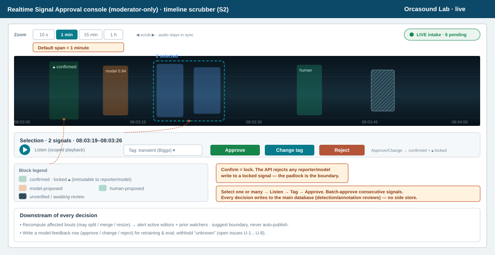

### Shared requirements (all options)

- **No waiting (KPI1):** moderation and notification workflows MUST become
  available as soon as qualifying activity is detected. No design may wait for
  the 15-minute no-detection gap, bout closure, or another timer before exposing
  the active bout and its evidence for moderator action. Later evidence may
  extend or recompute its boundaries without blocking initial review.
- **Initial inspection framing:** when opened from a model report whose parent
  window is `[D.start, D.end]` (60 seconds in v1), show
  `[D.start − 30 s, D.end + 30 s]`. This symmetric 2-minute viewport is centered
  on the parent window and exposes its full 60 seconds plus 30 seconds of audio
  before and after it. Do not draw the
  parent detection as a selectable interval. If no report is selected, fit the
  bout period with 30-second shoulders and a minimum 2-minute span.
- **Why not a shifted 1-minute viewport:** showing 30 seconds before the parent
  window and only its first half hides its latter half and guarantees a pan.
  That trades one boundary blind spot for another and increases the chance that
  the moderator confirms without reviewing all model evidence.
- **Boundary framing:** **Fit start boundary** shows the active boundary with the
  full 15-minute exterior gap and at least 1 minute inside the bout
  (`[start − 15 min, start + 1 min]`). **Fit end boundary** mirrors it
  (`[end − 1 min, end + 15 min]`). These dynamic 16-minute views are distinct
  from the 2-minute inspection default and expose `satisfied`, `unknown`, or
  `violated` boundary evidence without representing detections as editable
  objects.
- **Time axis with zoom:** default 2-minute window; zoom presets 10 s / 2 min /
  15 min / 1 h; horizontal scrub with audio kept in sync. Zooming or panning
  away from a fitted view is unrestricted.
- **Select:** one annotation, a rubber-band range, a checkbox list, or "all unmoderated in
  view."
- **Multi-select tagging (first-class):** a single **Confirm tags** or **Change labels**
  applies to the **entire selection** in one action, with a
  keyboard/gesture shortcut for "confirm all in view." Already-confirmed annotations
  are listed separately and require an explicit audited moderator revision; they
  are never silently skipped. This is the primary throughput lever and MUST be
  available in every option and on phone.
- **Listen:** scoped playback of the selected annotation/region (or sequential
  playback across a multi-selection).
- **Tag/confirm:** confirm existing tags or change the label/species; the chosen label
  applies to the whole selection. False positives are corrected to the appropriate
  non-target/source label. Edits write to the main database (§7), not a side store.
- **Authority on confirm:** reporter/model ingestion creates separate proposals
  and may not overwrite a confirmed decision. A moderator may revise it through
  an explicit audited action. Hard-lock enforcement remains an alternative in U-3.
- **Closed-bout intake:** moderation begins after the automatic 15-minute
  no-detection gap closes and logs a bout. Newly logged bouts enter the review
  queue; moderators do not need to annotate an open bout in real time.
- **Encoding for M2-A and dedicated views is unchanged from §4.0:** outline color encodes annotation label,
  solid/dashed/dotted outline encodes reporting source, and the corner glyph
  encodes moderation state. The same marker therefore reads identically in M2-A,
  dedicated alternatives, and the phone layout. M1's optional state fill remains
  confined to its lower swimlane markers.

### Option S1 — Time-rail triage inbox (list-centric)

Left: chronological, keyboard-navigable list of unmoderated annotations grouped by time.
Right: detail pane with the 2-minute contextual spectrogram, audio, tag editor, and
Confirm tags / Change labels. Optimized for **backlog throughput**.

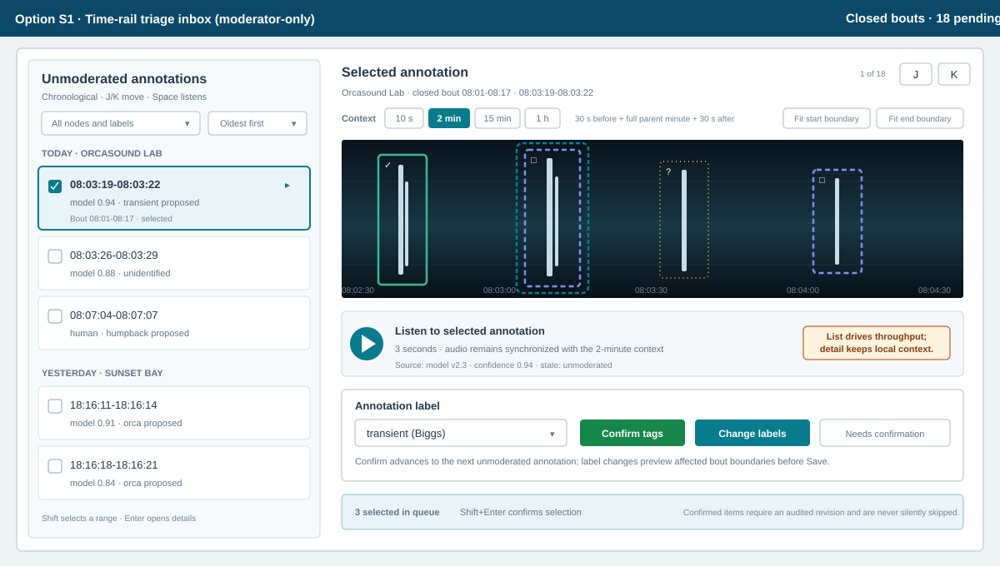

**Pros**
- Fastest per-item throughput; familiar inbox pattern; excellent keyboard flow.
- Great for clearing historical backlog (KPI 2).

**Cons**
- Weak spatial/temporal context; clustering and overlaps are hard to see.
- Zoom is per-item, not continuous.

### Option S2 — Continuous timeline scrubber (timeline-centric) — dedicated alternative

A horizontally scrolling spectrogram at a 2-minute default viewing span; annotations are selectable
blocks. Here, **horizontally scrolling** means that time moves beneath a fixed,
centered playhead. Dragging the spectrogram, overview window, or scrubber changes
the timestamp under the center marker; tapping an annotation recenters its time
under that marker. During playback, the spectrogram advances behind the centered
playhead; the position marker does not drift across the viewport. Zoom changes the span around
the same centered timestamp. Select one/many → listen → tag → confirm inline.
Confirmed blocks show a checkmark and remain authoritative when later
reporter/model proposals arrive.

```text
[◀ 08:02:30 ───── | 08:03:30 | ───── 08:04:30 ▶]   zoom: 10s · [2m] · 15m · 1h
spectrogram ░▒▓ annotations: ┌□┐unmoderated  ┌✓┐confirmed  ┌×┐false positive  ┌?┐needs confirmation
select ▢▢  →  ( Listen )  ( Label: transient ▾ )  ( Confirm tags )  ( Change labels )
```

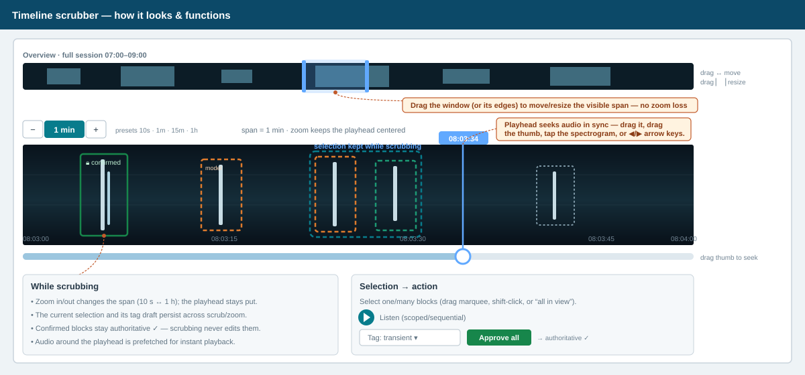

**Pros**
- Shows the whole parent minute plus symmetric context without requiring a pan.
- Strong temporal context; batch-confirm consecutive annotations; overlaps visible.
- Same timeline/audio/spectrogram components as the Workbench (reuse).

**Cons**
- Per-item confirmation can be slower than S1 for a huge undifferentiated backlog.
- Needs a good multi-select and "confirm selection" affordance.

### Option S3 — Proposed-vs-confirmed compare view (reconciliation)

Two aligned tracks: **model-proposed** annotations above, **human-proposed** below;
the moderator confirms the correct interpretation or writes a corrected tag.
Emphasis on reconciling proposed tags for the same annotation.

**Pros**
- Best for disagreements and for generating clean **model-eval / retraining**
  labels (§9).
- Makes reconciliation between proposed annotation tags explicit.

**Cons**
- Narrower use; heavier UI; overkill for simple, uncontested confirmations.

### Annotation-tagging views — comparison

| Option | Time-first / zoom | Throughput | Context | Model-feedback value | Build cost |
| ------ | :---------------: | :--------: | :-----: | :------------------: | :--------: |
| M2-A inline tagging | **Strong** | Medium-High | **Highest** | Medium | Low-Med |
| S1 triage inbox | Partial | **High** | Low | Medium | Low‑Med |
| S2 timeline scrubber | **Strong** | Medium‑High | **High** | Medium | Medium |
| S3 compare view | Strong | Medium | High | **High** | High |

**Recommendation:** build **M2-A as the primary v1 annotation-tagging workflow** within the
Moderator Workbench. Consider **S1** later for backlog blitzes and **S3** for
focused reconciliation; S2 is the dedicated-surface alternative if inline M2
cannot meet throughput needs. Every option writes through the same review API.

### Responsive phone view (all options)

The annotation-tagging workflow has a phone layout so moderators can clear unmoderated annotations
away from a desk. For M2-A this is the Workbench's stacked mobile layout, not a
separate destination. It is not a shrunk desktop grid; it is a single vertical
flow that keeps the same review contract.

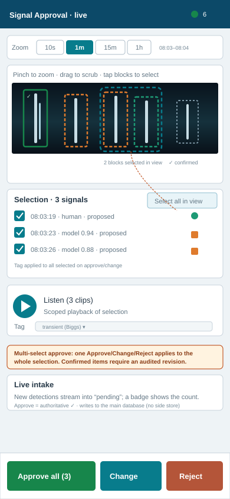

1. A compact header shows node, "live" state, and the pending count.
2. Zoom presets (10 s / **2 min** / 15 min / 1 h) sit above a pinch-zoomable,
   scrubbable spectrogram; tapping a block selects it.
3. **Multi-select is first-class on phone:** tap blocks, drag a marquee, use the
   checkbox list, or "Select all in view." A selection summary shows the count and
   time span.
4. **Listen** plays the selection (scoped or sequential); a single **Tag** applies
   to all selected.
5. A **sticky bottom bar** exposes **Confirm tags (N)** and **Change labels**;
  either action confirms the whole selection; confirmed members require an
  explicit audited revision and are never silently skipped.
6. Newly closed and logged bouts update the queue badge without losing the
  current selection, zoom, or playback position.

Minimum target 390 CSS-pixel viewport; controls ≥ 44×44 CSS px; horizontal
scrolling limited to the time-aligned spectrogram. Desktop and phone operate on the
same annotations and server state (mirrors bout-spec §8.2).

### Annotation-tagging flow

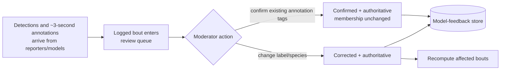

---

## 7. Proposed data-model additions

These extend the canonical relational model in **bout-spec §6b.2**. All additions
are UTC, append-only where they carry decisions, and preserve provenance.

### 7.1 Per-annotation moderation state

Add an explicit, queryable state to each approximately 3-second annotation.
One-minute detections do not receive this moderation state. Prefer a dedicated
column plus an append-only review history over a mutable flag.

| Field | Table | Type | Purpose |
| ----- | ----- | ---- | ------- |
| `moderation_state` | `annotations` | enum | `unmoderated` \| `confirmed` \| `false_positive` \| `needs_confirmation`. Drives the corner glyph. Label corrections remain append-only `annotation_reviews` actions rather than a display state. |
| `annotation_confirmed_tags` | new join table | rows | `{annotation_id, tag_id, confirmed_by, confirmed_at}`. The authoritative set of tags a moderator affirmed; supports multiple simultaneous species/sources on one annotation. |
| `confirmed_by` | same | FK → user | Moderator who confirmed/changed it. |
| `confirmed_at` | same | timestamptz | When it was confirmed/changed. |

`annotation_reviews` (append-only): `{id, annotation_id,
prior_state, new_state, prior_tag_ids[], new_tag_ids[], actor, at, comment}`. The
current state and authoritative tag set come from the newest review and its
`annotation_confirmed_tags` rows; history is never mutated.

> A confirmed annotation is not restricted to one species/source. For example,
> one approximately 3-second interval may be authoritatively tagged with both
> `srkw` and `vessel` and contribute to two overlapping bouts. A correction replaces the
> applicable member of the confirmed tag set rather than overwriting the whole
> set (for example, `{orca, vessel}` → `{seal, vessel}`).

> Existing detection-level reviews are not surfaced as annotation decisions and
> are not migrated automatically: a 1-minute review cannot reliably determine
> the state or tags of each approximately 3-second interval. Annotation state is
> populated from annotation-specific evidence or moderator review. A false
> positive still carries the appropriate non-target/source label for training
> and provenance.

> **Moderator editing and confirmed authority (§5).** A moderator confirmation or
> correction writes `annotation_reviews` and the corresponding
> `annotation_confirmed_tags`; it never rewrites source evidence from a reporter or
> model. Group edits create one auditable review per selected annotation. A stronger
> API hard lock is not part of this baseline; see U-3.

### 7.2 Species assignment & multi-bout membership (for the species-first overlay)

| Field | Table | Type | Purpose |
| ----- | ----- | ---- | ------- |
| Species/source lanes | derived from `annotation_confirmed_tags` (or proposed tags before confirmation) | projection | An annotation appears in every applicable species/source lane (Option M2); an annotation with no applicable tag renders in "Unassigned." This is not a singular stored field. |
| `annotation_bout_membership` | new join table | rows | `{annotation_id, bout_id, role}` — lets one annotation contribute to **multiple** overlapping bouts without duplication. |

### 7.3 Change tracking & watchers (for alerts)

| Field / table | Type | Purpose |
| ------------- | ---- | ------- |
| `change_events` (new) | rows | `{id, entity_type: bout\|annotation, entity_id, change_type, from, to, actor, at, affected_bout_ids[]}`. One row per annotation-label or bout change that may affect bout membership; drives change alerts. Annotation confirmation is audited in `annotation_reviews` but does not trigger bout recomputation. |
| `bout_watch` (new) | rows | `{bout_id, user_id, reason: working\|worked, created_at}`. Populated when a moderator claims/edits a bout, and retained after publish so prior reviewers can be alerted later. |
| `bout_lineage` (new) | rows | `{predecessor_bout_id, successor_bout_id, reason: split\|merge, change_event_id}`. Split and merge results always receive fresh bout IDs while retired source IDs remain traceable for audit and links. |

### 7.4 Model-feedback fields

| Field | Table | Type | Purpose |
| ----- | ----- | ---- | ------- |
| `model_feedback` | new table | rows | `{id, annotation_id, model_reporter_id, model_label, model_confidence, moderator_label, decision: confirm\|change, at, export_state}`. The clean supervised annotation for retraining/eval (§9); a false positive is represented by `change` plus the moderator's non-target/source label. |
| `export_state` | `model_feedback` | enum | `pending` \| `exported` \| `excluded`. Lets ambiguous/unknown items be withheld from training. |

---

## 8. Change propagation & alerts

Confirming an annotation affirms its existing tags. It does **not** change the
annotation's bout membership or boundaries, and therefore never merges or grows a
bout. A label change can affect bouts in either direction:

- **Change the label on any member annotation** to a label outside the bout's
  species/source → recompute the complete ordered membership. Removing an
  outermost member may **shrink** the bout; removing an interior member may open
  a gap of at least 15 minutes and **split** it. An annotation does not need to
  anchor an outer boundary to cause a split.
- **Change the label on an annotation from another bout/source to the label for this
  bout** → the annotation joins this bout; it may fill a former gap so two bouts
  **merge**, or extend the nearest boundary so the bout **grows**.
- **Change species** (humpback → transient) → the annotation leaves one species bout
  and joins another; **both** bouts' boundaries may move.

> **Interior split example.** A 20-minute bout has same-lane annotations at
> minutes 1, 10, and 20. The minute-10 annotation is not an outer-boundary
> anchor, but it bridges the other two annotations: the initial adjacent gaps
> are 9 minutes (`10 − 1`) and 10 minutes (`20 − 10`), both under 15 minutes.
> Changing its label so it leaves the lane makes the remaining annotations 19
> minutes apart (`20 − 1`). The generator therefore retires the original bout
> and creates two successor bouts, each with a fresh ID and linked to the
> predecessor through `bout_lineage`.

Design:

1. Every label change that alters bout membership writes a `change_events` row
  with `affected_bout_ids`. Confirmation still writes its normal audit and model-
  feedback records, but creates no bout-boundary change.
2. Before Save is enabled, the generator computes the complete resulting set of
  candidate and published bouts, including membership, boundaries, type, tags,
  and any split or merge. The UI previews those results alongside the label
  change. If the result cannot satisfy the bout timeframe invariant, Save remains
  disabled; the moderator cannot create an intermediate illegal state.
3. Saving commits the annotation review, membership changes, recomputed bouts, and
  `change_events` audit rows in one transaction. No intermediate boundary state
  is persisted. Updating an already-published bout is audited but does not send a
  subscriber notification or publish a candidate.
  If one bout splits into two, the original bout is retired and both resulting
  bouts receive new IDs; neither child inherits the original ID. A merge likewise
  retires every source bout and creates one new ID. `bout_lineage` links each
  retired predecessor to its new successor or successors.
4. **Active editors** of an affected bout see an inline banner ("Evidence changed
  — boundary updated") with optimistic-concurrency handling and a before/after
  diff.
5. **Watchers** (`bout_watch.reason = worked`) get an inbox/notification badge:
   "A bout you reviewed changed," linking to a diff of before/after.

### 8.3 Activity resumes after closure: moderator force merge

Ordinary bout creation exposes the active bout for moderation as soon as qualifying
activity is detected; it does not wait for the 15-minute no-detection gap. That gap
only determines when the bout closes. If relevant activity resumes after closure,
the new activity immediately starts a separate bout under bout-spec R1. The Workbench offers an
explicit **Force merge bouts** action when a moderator determines that adjacent
bouts on the same node and with the same species/source represent one continuous
real-world event.

Force merge is not normal boundary recomputation: it is an intentional exception
to the 15-minute gap invariant. The confirmation preview shows both source bouts,
the intervening gap, and the resulting combined timeframe. The moderator must
provide a reason. Saving atomically creates the merged bout, retires and
lineage-links the source bouts, and appends a `change_events` audit record with
the actor, reason, source IDs, gap duration, and resulting bout ID. It does not
notify subscribers or republish automatically. Different-node or
different-species/source bouts cannot be force-merged.

### 8.1 Existing-bout correction: orca annotation → seal

A reviewer opens an existing orca bout from the Bouts page or from an "A bout you
reviewed changed" alert. The Workbench opens in **review existing bout** mode and
keeps the bout boundary visible while the species overlay shows each member
annotation. The reviewer selects the misidentified orca annotation and listens to its
exact interval; the details panel shows its current `orca` identification,
reporter/model provenance, confidence, moderation state, and review history.

The reviewer chooses **Change**, selects `seal`, and sees an inline preview before
confirming:

- the annotation moves from the orca lane to the seal lane;
- the annotation leaves the orca bout and joins or seeds the applicable seal bout (potentially resulting in merging two existing seal bouts);
- every affected bout is listed with its current and resulting boundaries; and
- any title, type, tag, split, or merge consequence is called out explicitly.

Confirming writes an `annotation_reviews` entry (`orca` → `seal`), keeps the annotation
authoritative while later reporter/model input remains separate, records model
feedback, updates every affected bout to the previewed valid result, and emits one
`change_events` row naming those bouts in the same transaction. There is no second
boundary-acceptance step. Correcting the annotation does not publish a candidate bout
or notify subscribers (see U-7).

### 8.2 Existing-bout correction: unidentified opening annotations → ship

A reviewer opens an existing bout and zooms to the small unidentified annotations at
its beginning. They drag a marquee over the run, then add or remove individual
annotations by Shift-click on desktop or checkboxes on phone. The selection summary
shows the count, total time span, current tags and moderation states. **Listen to
selection** plays the intervals in sequence so the reviewer can verify that the
whole group has the same ship source before changing it.

The reviewer chooses **Change selection**, identifies the source as **ship**
(canonical tag `vessel`), and receives one confirmation screen for the batch. The
screen lists every annotation that will change and flags any item that cannot be
revised under the moderator-override policy (U-3); an ineligible item is never
silently skipped. The preview moves the selected annotations into a vessel lane and
shows the resulting anthrophony/vessel bout. If those annotations anchored the
original bout's start, it also shows that boundary moving to the first remaining
annotation and displays both bouts before and after the change.

Confirming creates one append-only `annotation_reviews` record per selected annotation,
corresponding `change_events` and model-feedback records, and an audit link that
groups them as one batch action. The same transaction updates every affected
candidate or published bout to its previewed valid state. If any result cannot be
validated, none of the batch is saved. The update never publishes a candidate
bout or sends a subscriber notification.

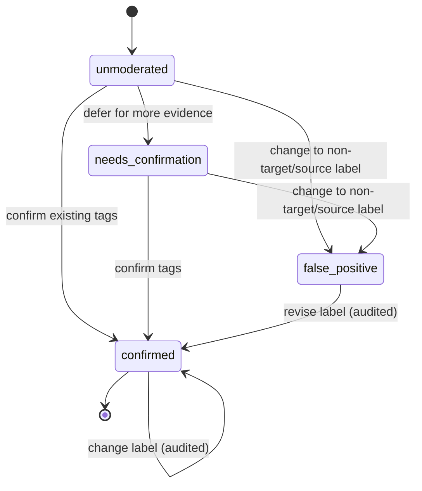

---

## 9. Recent high-value bouts

Moderators need a quick way to revisit strong examples so they can calibrate what
clear, useful annotations look and sound like. Add a **Recent bouts** view that uses
the same bout cards, timeline, audio player, and species/source overlays as the
Workbench. It is a review and learning surface, not another moderation queue.

### 9.1 Ranking and filters

The default **High value first** order is deterministic and transparent:

1. Bouts carrying the moderator-assigned `high-value` tag appear first.
2. Within the high-value group, bouts are ordered newest first.
3. Remaining bouts follow, also newest first.

Model confidence does not automatically make a bout high value and is not folded
into a hidden quality score. Moderators can switch to **Newest first** and filter
by node, species/source, date, moderator, and `high-value` status. Each result
shows the bout title, node, time, tags, contributing annotation count, reviewer, and a
compact spectrogram with a play action.

### 9.2 Mark high value while reviewing

While creating or updating a bout, a moderator can toggle a star action labeled
**High Value** in the bout details panel. Turning it on adds the canonical
`high-value` bout tag; turning it off removes that tag. This remains a pending
edit until the moderator chooses **Save bout changes**, so they can adjust several
fields or continue inspecting the current spectrogram range before committing.
Save applies the pending metadata together and appends `{who, when, field: tags,
from, to}` to the bout's `review_history`. It preserves the current zoom,
playhead, and selection. Reporters and models may see the saved tag but cannot set
or remove it.

The control includes a short optional note for why the example is valuable, such
as clear signal-to-noise ratio, representative call type, unusual species, or a
useful correction example. The note is displayed in the Recent bouts view but is
not part of ranking. Applying or removing `high-value` does not publish the bout
or notify subscribers.

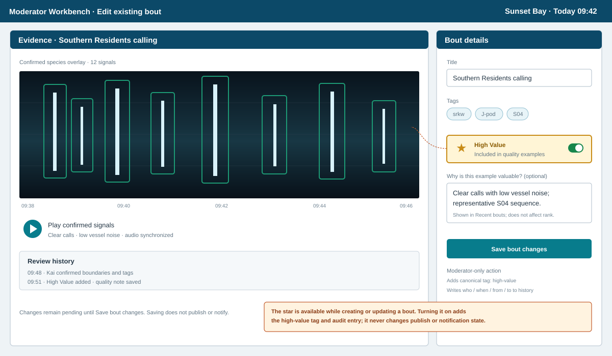

### 9.3 Sample recent-bouts view

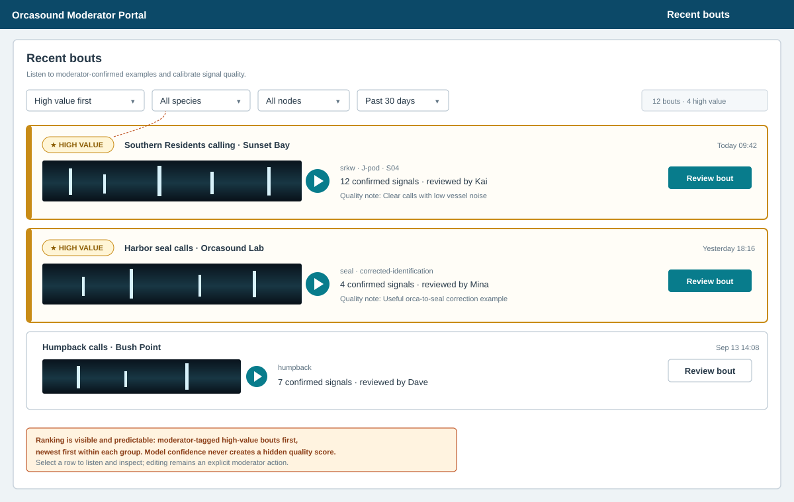

Selecting a row opens the existing bout in read-only review mode by default.
Moderators can choose **Edit bout** to enter the correction workflow in §8.1–§8.2,
while other viewers can inspect and play the confirmed annotations without changing
them.

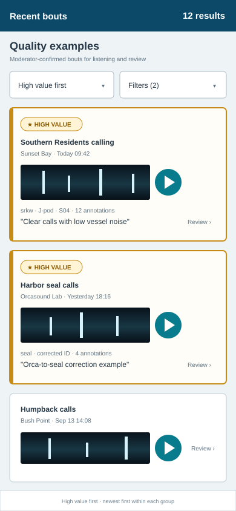

## 10. Open issues

Add these to bout-spec **Appendix A** if adopted.

| ID | Open question | Why it matters / proposed direction |
| -- | ------------- | ----------------------------------- |
| U-1 | **Atomic recompute failure handling:** if the system cannot compute a valid post-change bout set, what recovery detail should the moderator see? | Direction decided: preview the automatic result and disable Save until the label change and all affected bouts can commit atomically. Confirmation alone never changes a boundary. Open detail: error/retry presentation. |
| U-3 | **Confirmed-annotation write policy:** is append-only authority sufficient (reporter/model input becomes a separate proposal and moderators revise through audited actions), or should the API additionally hard-lock confirmed records? If hard locking is adopted, who may override it and with what precedence? | The baseline in this proposal uses append-only authority to match the bout spec's guidance to avoid hard locking. A padlock/`locked` field MUST NOT be implemented unless stakeholders choose the stronger alternative and define moderator override, takeover, and audit behavior. |
| U-4 | **What is fed back to models, and when?** confirmed labels, corrected labels (including humpback↔transient and false-positive→non-target/source), and boundary-adjacent negatives — in what format and cadence, and how are `unknown`/ambiguous items excluded? | Drives retraining quality (KPI 3). Proposed: export `model_feedback` where `export_state = pending` and decision ∈ {confirm, change}; withhold `unknown`. |
| U-5 | **Force-merge policy:** should the audited force-merge exception have a maximum gap or require a second moderator? | Queue timing is decided: KPI1 requires the active bout to enter moderation immediately, without waiting for its 15-minute closing gap. Resumed same-node, same-species/source activity creates a new bout immediately; a moderator may explicitly force-merge it (§8.3). Adopting force merge requires a narrow normative exception to bout-spec R1 and the timeframe invariant. |
| U-6 | **`unknown` / `SRKWFound` semantics:** how does annotation-level `unknown` map to the bout spec's `SRKWFound` scope question (Appendix A item C)? | An annotation changed from SRKW may still be valid *other-species* or source evidence; the replacement label must identify what is present. |
| U-7 | **Does approving a logged bout notify subscribers immediately, or only when it is explicitly published** (bout-spec §9)? | Annotation tagging never notifies. Keeping notification exclusively on the bout's publish action prevents duplicate notifications and preserves the normative publish gate. |

## 11. Recommendation summary

- **Moderator overlay:** make the **Reporter ⇄ Species pivot toggle** (§4.0) a
  baseline control in the main interface; default to the **species pivot / M2
  (species-first swimlanes)** to solve the mixed-species / two-bout requirement,
  layered with **M3's minimap** for change alerts; adopt a single moderation-state
  vocabulary (`□` unmoderated, `✓` confirmed, `×` false positive, `?` needs
  confirmation) shared everywhere. M1's optional state fills are not part of the
  shared baseline.
- **Moderator editing:** integrate single-annotation and group tagging directly into
  the §4 overlay; preserve timeline context and require audited revisions for
  confirmed annotations. A separate non-moderator historical-data overlay is out of
  scope for v1.
- **Post-bout review:** build **M2-A inline annotation tagging** in the main
  species-first overlay as the primary v1 workflow: time-first, symmetric 2-minute
  contextual viewing span, dedicated start/end boundary framing, zoomable,
  select/listen/tag/confirm, **first-class multi-select
  tagging**, authoritative annotation confirmation, separate bout approval,
  closed-bout queue intake, and a responsive phone layout with a sticky Confirm
  tags / Change labels bar. Keep S1–S3 as optional specialized
  views, not required navigation.
- **Data:** add per-annotation `moderation_state` + confirmation fields, the
  many-to-many `annotation_confirmed_tags` relation, `annotation_bout_membership`,
  `change_events`, `bout_watch`, and `model_feedback`, extending bout-spec §6b.2;
  do not add a `locked` field unless U-3 resolves in favor of hard enforcement.
- **Loop safety:** preview label-change effects, then atomically update all
  affected bouts so the timeframe invariant holds unless a moderator deliberately
  uses the audited same-node, same-species/source **Force merge bouts** exception;
  alert active editors and prior watchers, and feed a clean supervised set back
  to models.
- **Quality calibration:** add a Recent bouts view ordered by moderator-assigned
  `high-value` first, with newest-first ordering inside each group and no opaque
  confidence-derived quality score.
